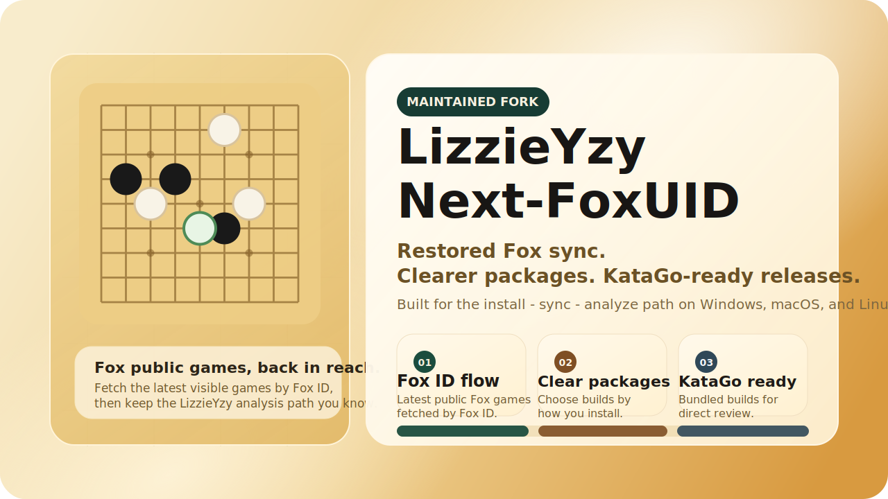

  

  
  
  
  
  
  

  中文 · <a href="README_EN.md">English</a> · <a href="README_JA.md">日本語</a> · <a href="README_KO.md">한국어</a>

  <strong>继续维护的 LizzieYzy 版本，重点把原版已经失效的野狐棋谱同步重新做回可用状态。</strong> 
  现在统一通过 <strong>野狐ID</strong> 获取最新公开棋谱，并把首启自动配置、整合包和跨平台发布一起补齐。

  <a href="https://github.com/wimi321/lizzieyzy-next-foxuid/releases">下载发布包</a>
  ·
  <a href="#先下载哪个">先下载哪个</a>
  ·
  <a href="#三分钟上手">三分钟上手</a>
  ·
  <a href="#发布包说明">发布包说明</a>
  ·
  <a href="#文档与支持">文档与支持</a>

> [!IMPORTANT]
> 这个维护版优先解决的不是“再做一堆新功能”，而是把原项目最常用的链路重新做顺：
> - 修复野狐棋谱同步，界面入口统一为“野狐棋谱（输入野狐ID获取）”
> - 首次启动优先自动配置内置 KataGo、权重和默认引擎路径
> - 重新整理发布包，Windows 主推荐为 `.installer.exe`，macOS 主推荐为 `.dmg`

## 先下载哪个

| 你现在在用什么 | 直接下载这个 | 这是给谁的 |
| --- | --- | --- |
| Windows 64 位，想装完就用 | `windows64.with-katago.installer.exe` | 最省事，双击安装，首启自动优先配置内置 KataGo |
| Windows 64 位，想免安装 | `windows64.with-katago.portable.zip` | 想解压后直接运行，不走安装向导 |
| Windows 64 位，想自己配引擎 | `windows64.without.engine.portable.zip` | 保留程序主体和运行时，KataGo 自己配 |
| macOS Apple Silicon | `mac-arm64.with-katago.dmg` | M1 / M2 / M3 / M4 等机器 |
| macOS Intel | `mac-amd64.with-katago.dmg` | Intel 芯片 Mac |
| Linux 64 位 | `linux64.with-katago.zip` | 想直接开始分析和抓谱 |
| 老机器或进阶自定义 | `windows32.without.engine.zip` / `Macosx.amd64.Linux.amd64.without.engine.zip` | 明确知道自己在做什么时再选 |

> [!TIP]
> 旧版本 release 里如果暂时还没有新的 Windows 安装器或便携包，先用同日期的 `windows64.with-katago.zip` 也能启动。后续 Windows 主下载项会统一切到安装器和 `.exe` 便携包。

## 为什么这个项目值得关注

如果你以前用过 `lizzieyzy`，最在意的通常不是“有没有换一套新 UI”，而是下面这些事是不是终于变得简单了：

- 原来已经失效的野狐棋谱同步，现在能不能重新用起来
- 第一次打开时，还要不要手工折腾引擎、权重、配置路径
- 发布页是不是还像以前那样，一堆包名看不懂、不知道该下哪个
- 换一台 Windows、Mac 或 Linux 机器时，能不能重新快速装起来

`LizzieYzy Next-FoxUID` 就是围绕这些真实问题继续维护的分支。目标很直接：

- 能安装
- 能启动
- 能抓野狐公开棋谱
- 能继续用 KataGo 分析

## 三分钟上手

1. 去 [Releases](https://github.com/wimi321/lizzieyzy-next-foxuid/releases) 选对自己系统的包。
2. Windows 用户优先选 `windows64.with-katago.installer.exe`；macOS 用户按芯片选 `.dmg`；Linux 用户选 `linux64.with-katago.zip`。
3. 第一次启动时，程序会优先自动识别内置 KataGo、配置文件和默认权重。
4. 打开 **野狐棋谱（输入野狐ID获取）**，输入纯数字野狐ID，获取最新公开棋谱。
5. 继续用内置或自定义 KataGo 做分析和复盘。

## 首次启动现在会自动做什么

现在的首启流程，不再默认把用户丢进一堆手工设置里。

程序会优先尝试：

- 检测包内是否已经带好 KataGo、配置文件和默认权重
- 自动写入可用的默认引擎配置
- 如果本地缺少权重，提供下载推荐官方权重的入口
- 只有在自动配置仍然失败时，才退回到手工设置界面

这套逻辑的目标很明确：让大多数普通用户第一次打开就能直接开始用，而不是先研究引擎路径。

## 项目截图

## 发布包说明

> [!TIP]
> 对大多数人来说，记住一句话就够了：想省事就选 `with-katago`，想完全自定义再选 `without.engine`。

| 系统 | 推荐资产 | 是否内置 Java | 是否内置 KataGo | 安装方式 |
| --- | --- | --- | --- | --- |
| Windows 64 位 | `windows64.with-katago.installer.exe` | 是 | 是 | 双击安装，开始菜单和桌面快捷方式 |
| Windows 64 位 | `windows64.with-katago.portable.zip` | 是 | 是 | 解压后运行 `LizzieYzy Next-FoxUID.exe` |
| Windows 64 位 | `windows64.without.engine.portable.zip` | 是 | 否 | 解压后运行，自行配置引擎 |
| Windows 32 位 | `windows32.without.engine.zip` | 否 | 否 | 兼容用途，需要自装 Java |
| macOS Apple Silicon | `mac-arm64.with-katago.dmg` | App 自带运行时 | 是 | 拖入 Applications |
| macOS Intel | `mac-amd64.with-katago.dmg` | App 自带运行时 | 是 | 拖入 Applications |
| Linux 64 位 | `linux64.with-katago.zip` | 是 | 是 | 解压后运行 `start-linux64.sh` |
| 进阶用户 | `Macosx.amd64.Linux.amd64.without.engine.zip` | 否 | 否 | 手工配置 Java 和引擎 |

补充说明：

- Windows 现在把安装器放在最前面，是为了让普通用户不用再去理解 `.bat`。
- Windows 的无引擎包也改成 `.exe` 便携形式，不再把 `.bat` 作为主入口。
- macOS 继续以 `.dmg` 为主，不再把 `app.zip` 作为主推荐。
- Linux 继续保留可直接运行的整合包。

## 现在和原版有什么不同

| 项目 | 原版 LizzieYzy | Next-FoxUID |
| --- | --- | --- |
| 野狐棋谱同步 | 对很多用户已经失效 | 已修复并继续维护 |
| 输入方式 | UID / 用户名 / 其它叫法混在一起 | 统一为野狐ID |
| 首次启动 | 经常需要自己配引擎 | 优先自动配置内置引擎 |
| Windows 使用体验 | 主要依赖 zip + bat | 以 `.installer.exe` 和 `.exe` 便携包为主 |
| macOS 发布 | 历史包型偏杂 | 以 `.dmg` 为主，区分 Apple Silicon / Intel |
| 项目维护 | 基本停滞 | 持续发包、修文档、收反馈 |

## 当前整合包内置内容

| 项目 | 当前值 |
| --- | --- |
| KataGo 版本 | `v1.16.4` |
| 默认内置权重 | `g170e-b20c256x2-s5303129600-d1228401921.bin.gz` |
| 首启自动配置 | 已启用 |
| 权重补全能力 | 支持下载推荐官方权重 |

常见路径：

- Windows / Linux 整合包权重：`Lizzieyzy/weights/default.bin.gz`
- macOS 整合包权重：`LizzieYzy Next-FoxUID.app/Contents/app/weights/default.bin.gz`
- macOS 整合包引擎：`LizzieYzy Next-FoxUID.app/Contents/app/engines/katago/`

## 文档与支持

| 你需要什么 | 入口 |
| --- | --- |
| 安装说明 | [安装指南](docs/INSTALL.md) |
| 看懂所有发布包 | [发布包说明](docs/PACKAGES.md) |
| 启动失败 / 抓谱无结果 / 引擎没连上 | [常见问题与排错](docs/TROUBLESHOOTING.md) |
| 看哪些平台已经有人实测 | [已验证平台](docs/TESTED_PLATFORMS.md) |
| 了解如何发版 | [发布检查清单](docs/RELEASE_CHECKLIST.md) |
| 获取帮助 | [Support](SUPPORT.md) |
| 查看更新历史 | [更新日志](CHANGELOG.md) |

## 常见问题

<strong>为什么只支持野狐ID，不支持用户名搜索？</strong>

因为用户名搜索更容易误判，也更难维护。这个维护版统一按野狐ID工作，界面、文档和问题反馈模板都按这个口径整理。

<strong>第一次打开还需要自己设置引擎吗？</strong>

大多数用户不需要。现在程序会优先自动识别内置 KataGo、默认权重和配置路径。只有自动配置仍然失败时，才需要你手工处理。

<strong>Windows 为什么改成 installer.exe 作为主推荐？</strong>

因为普通用户真正需要的是“下载、双击、装好、能打开”，而不是先理解 `.bat`、Java 路径和目录结构。便携包仍然保留，但不再作为主入口。

<strong>macOS 为什么第一次可能会被拦住？</strong>

因为当前维护版的 macOS 包还没有做签名 / 公证。第一次被 Gatekeeper 拦截是正常现象，按安装文档里的“仍要打开”步骤处理即可。

## 参与维护

当前最欢迎的反馈和贡献：

- Windows / Linux / Intel Mac 的真实安装反馈
- 野狐抓谱兼容性反馈
- 发布页、安装文档、翻译文案优化
- 打包、首启自动配置、引擎集成相关修复

相关入口：

- [Contributing Guide](CONTRIBUTING.md)
- [Code Of Conduct](CODE_OF_CONDUCT.md)
- [Security Policy](SECURITY.md)
- [Issues](https://github.com/wimi321/lizzieyzy-next-foxuid/issues)
- [Discussions](https://github.com/wimi321/lizzieyzy-next-foxuid/discussions)

## 致谢

- 原项目：[yzyray/lizzieyzy](https://github.com/yzyray/lizzieyzy)
- KataGo：[lightvector/KataGo](https://github.com/lightvector/KataGo)
- 野狐抓谱历史参考：
  - [yzyray/FoxRequest](https://github.com/yzyray/FoxRequest)
  - [FuckUbuntu/Lizzieyzy-Helper](https://github.com/FuckUbuntu/Lizzieyzy-Helper)
