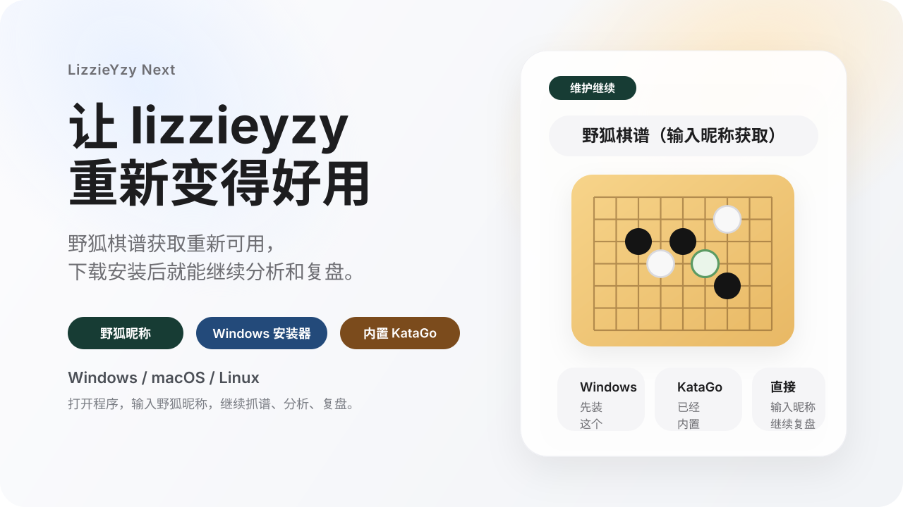

  

  
  
  
  
  

  简体中文 · <a href="README_ZH_TW.md">繁體中文</a> · <a href="README_EN.md">English</a> · <a href="README_JA.md">日本語</a> · <a href="README_KO.md">한국어</a> · <a href="README_TH.md">ภาษาไทย</a>

  <strong>LizzieYzy Next 是仍在维护的 lizzieyzy 分支，面向使用 KataGo 复盘的普通棋友。</strong> 
  提供野狐昵称抓谱、快速全盘分析、新版胜率图和底部快速概览，并发布 Windows、macOS、Linux 版本。

  <a href="https://goagent.top/"><strong>官方网站</strong></a>
  ·
  <a href="https://goagent.top/download/"><strong>正式版下载</strong></a>
  ·
  <a href="https://pan.baidu.com/s/1wthaL8YwGMxy_u0U7Mabpw?pwd=3i8w"><strong>百度网盘下载</strong></a>
  ·
  <a href="docs/INSTALL.md"><strong>安装说明</strong></a>
  ·
  <a href="docs/TROUBLESHOOTING.md"><strong>常见问题</strong></a>

> [!NOTE]
> 国内用户建议从 [官网下载页面](https://goagent.top/download/) 下载正式版；需要安装器、Linux 包或历史版本时，可使用 [GitHub Releases](https://github.com/wimi321/lizzieyzy-next/releases)。
>
> 国内用户也可使用公开百度网盘下载：
> [https://pan.baidu.com/s/1wthaL8YwGMxy_u0U7Mabpw?pwd=3i8w](https://pan.baidu.com/s/1wthaL8YwGMxy_u0U7Mabpw?pwd=3i8w)
> 提取码：`3i8w`

> [!TIP]
> [项目讨论 QQ 群：299419120](https://qm.qq.com/q/JZoeojjteg)
>
> 欢迎交流使用问题、反馈 bug、分享使用体验，或者讨论接下来最想加的功能。

## 你打开后马上能做什么

| 你想做什么 | 这个项目现在怎么解决 |
| --- | --- |
| 抓最近公开野狐棋谱 | 直接输入野狐昵称，程序自动匹配账号并抓谱 |
| 快速看整盘走势 | 提供快速全盘分析，不用完全靠一步一步手点 |
| 快速找问题手 | 提供新版主胜率图和底部热力概览，更容易一眼看出大问题手 |
| 减少快速曲线对主引擎的影响 | 可在 `KataGo 一键设置 -> 权重管理` 按需下载 38 MB 官方轻量模型；仅补齐棋谱曲线时启动，主分析开始即释放显卡 |
| 少折腾配置 | 推荐整合包已内置 KataGo、默认权重和首次自动配置 |
| 不想安装 | Windows 默认优先推荐 `portable.zip` 免安装包 |
| 做棋盘同步 | Windows 主发布包已内置原生 `readboard.exe`，同步入口更清晰 |
| 本机算力不够 | `设置 -> 远程算力中心` 可登录智子云算力，创建远程 KataGo 引擎后像本机引擎一样使用 |

远程算力中心默认使用“VIP 包月”（`--gpu-type vip-share`）；非 VIP 用户可在高级设置中切换到“按量 1x / 3x / 6x”等档位。默认预设使用智子28B模型。TensorRT/CUDA 指云端引擎后端，不是充值套餐名。

勾选“记住登录/密码”后，凭据由 Windows DPAPI、macOS Keychain 或 Linux Secret Service 保护，不写入普通配置。系统安全存储不可用时，凭据只保留到程序退出。断线后会自动重连，也可一键切回本机引擎。

有 Linux x86_64 NVIDIA GPU 服务器、但还没有 `WSS` 链接时，可使用 [KataGo 远程算力一键部署](https://github.com/wimi321/katago-remote-one-click)。在服务器运行一条命令即可生成加密链接和二维码，再到 `远程算力 -> 自建算力` 中粘贴或导入；无需自行开放公网端口。

## 先下载哪个

  

| 你的情况 | 到 Releases 里找包含这个关键词的文件 |
| --- | --- |
| Windows，RTX 20/30/40/50 NVIDIA 显卡，推荐，免安装 | `*windows64.nvidia.portable.zip` |
| Windows，RTX 20/30/40/50 NVIDIA 显卡，想安装 | `*windows64.nvidia.installer.exe` |
| Windows，AMD / Intel / 较老 NVIDIA 显卡，免安装 | `*windows64.opencl.portable.zip` |
| Windows，AMD / Intel / 较老 NVIDIA 显卡，想安装 | `*windows64.opencl.installer.exe` |
| Windows，没有合适 GPU 或 GPU 版本无法启动，CPU 兼容版 | `*windows64.with-katago.portable.zip` |
| Windows，CPU 兼容版，想安装 | `*windows64.with-katago.installer.exe` |
| 已经有 Windows 免安装版，日常升级 | `*windows64.core-update.zip`，解压到旧目录覆盖 |
| Windows，RTX 30 系及以下，想测试 TensorRT | 先下载统一 NVIDIA 包，再在 `KataGo 一键设置` 里选装 |
| Windows，RTX 30 系及以下，想离线测试 TensorRT | `*windows64.nvidia.tensorrt.portable.7z.001` 起的全部分卷，先看同名 `README.txt` |
| Windows，DirectX 12 GPU，参与 DirectML 测试 | `*windows64.experimental.directml.portable.zip` |
| Windows，Intel GPU/NPU，参与 OpenVINO 测试 | `*windows64.experimental.openvino.portable.zip` |
| Windows，AMD RX 6000/7000/9000 或 Ryzen AI Max，参与 ROCm 测试 | 选择对应 `*windows64.experimental.rocm.*.portable.zip` |
| Windows，自己配引擎，免安装 | `*windows64.without.engine.portable.zip` |
| Windows，自己配引擎，想安装 | `*windows64.without.engine.installer.exe` |
| macOS Apple Silicon，打开后拖到“应用程序” | `*mac-apple-silicon.with-katago.dmg` |
| macOS Intel，打开后拖到“应用程序” | `*mac-intel.with-katago.dmg` |
| Linux | `*linux64.with-katago.zip` |

Windows `portable.zip` 把配置、日志、棋谱、权重和软件内安装的 TensorRT 文件保存在解压目录，主要位于 `user-data/`。删除整个目录即可卸载；换目录升级时，复制 `user-data/` 可保留设置。

已有 Windows 免安装版时，小版本升级可下载 `*windows64.core-update.zip`。关闭软件后，把 zip 内容解压到原目录并覆盖旧文件。该包只更新 `app/lizzie-yzy2.5.3-shaded.jar`、`app/LizzieYzy Next*.cfg` 和供旧版自动更新器识别的兼容文件，不会覆盖 `weights/`、`engines/`、`runtime/`、`jcef-bundle/`、`readboard/` 或 `user-data/`。如果 release 说明包含 KataGo、权重或运行环境升级，请改用完整包或对应资源包。

完整包的 CPU、OpenCL、CUDA、TensorRT、Metal 后端和 Linux 包均使用 KataGo `v1.18.1`。Linux NVIDIA 仍使用 CUDA 12.1，以兼顾系统运行环境。

主推荐完整包默认内置官方旗舰 B11 `b11c768h12nbt3tflrs-fson-silu.bin.gz`（约 202 MiB）；本机 RTX 3070 实测搜索吞吐比 B10 慢约 40%，追求速度可在 `KataGo 一键设置 -> 权重` 中切换 B10。

NVIDIA 和 TensorRT 说明：

- `KataGo 一键设置` 会检测 NVIDIA GPU 和 Compute Capability，并提示是否推荐 TensorRT；检测失败时仍可手动继续。
- RTX 40/50 默认使用 CUDA。TensorRT 是 RTX 30 系及以下的可选方案；安装完成后会自动删除下载包，旧缓存可在一键设置中清理。
- NVIDIA 驱动 `570.65` 及以上可直接加载；`528.33–570.64` 首次运行会做一次轻量推理探测；更旧驱动会显示修复状态。
- 离线安装 TensorRT 时，下载 `*windows64.nvidia.tensorrt.portable.7z.001/.002/...` 全部分卷，并使用 7-Zip 从 `.001` 解压。先阅读同名 `README.txt`。
- GTX 10 系以前的显卡优先使用 OpenCL 包。OpenCL 不稳定时，改用 `*windows64.with-katago.portable.zip`。

## 三步开始

1. 去 [正式版下载页](https://goagent.top/download/) 下载适合自己系统的包；需要安装器、Linux 或历史版本时使用 GitHub Releases。
2. 打开程序后，点击 `野狐棋谱`，输入野狐昵称。
3. 抓到棋谱后继续做快速全盘分析，用主胜率图和底部快速概览直接定位关键手。

  

  如果 GitHub 里的动图加载慢，直接点上面的图就能看完整演示。

## 界面预览

  

主胜率图和底部快速概览包含：

  

- 蓝线 / 紫线：双方胜率走势
- 绿色线：目差变化
- 底部热力概览：整盘问题手分布，红橙黄越多，越值得先看
- 竖向定位线：当前手或悬停手的位置

## 它和原来的 lizzieyzy 有什么区别

| 对比项 | 原 `lizzieyzy` | `LizzieYzy Next` |
| --- | --- | --- |
| 当前状态 | 历史项目，很多人还记得，但长期缺少持续维护 | 当前维护分支，继续修可用性和发布体验 |
| 野狐抓谱 | 老流程陆续失效 | 已恢复常用抓谱链路，支持昵称输入 |
| 输入方式 | 更依赖先知道账号数字 | 直接输入野狐昵称，程序自动匹配账号 |
| KataGo 使用门槛 | 常常需要自己补环境或补资源 | 推荐整合包已内置 KataGo 和默认权重 |
| Windows 下载体验 | 需要用户自己判断更多 | 明确优先推荐 `portable.zip` 免安装包 |
| 同步工具 | 用户自己拼环境的情况更多 | Windows 主发布包内置原生 `readboard.exe` |

## macOS 首次启动

先确认下载的芯片版本正确，再打开 DMG，按画面箭头把 `LizzieYzy Next` 拖到“应用程序”，弹出安装磁盘后从 Finder 的“应用程序”启动。当前官方 release 流程会完成签名和公证；如果系统仍拦截，请按 [安装说明](docs/INSTALL.md) 排查。

## 文档与参与

- [获取帮助](SUPPORT.md)
- [安装说明](docs/INSTALL.md)
- [发布包说明](docs/PACKAGES.md)
- [常见问题与排错](docs/TROUBLESHOOTING.md)
- [已验证平台](docs/TESTED_PLATFORMS.md)
- [GitHub Releases](https://github.com/wimi321/lizzieyzy-next/releases)
- [GitHub Discussions](https://github.com/wimi321/lizzieyzy-next/discussions)
- [QQ 群：299419120](https://qm.qq.com/q/JZoeojjteg)
- [项目路线图](ROADMAP.md)
- [参与贡献](CONTRIBUTING.md)
- [更新日志](CHANGELOG.md)

## 致谢

- 原项目：[yzyray/lizzieyzy](https://github.com/yzyray/lizzieyzy)
- KataGo：[lightvector/KataGo](https://github.com/lightvector/KataGo)
- 棋盘同步工具：[qiyi71w/readboard](https://github.com/qiyi71w/readboard)

感谢 [qiyi71w](https://github.com/qiyi71w) 持续维护和优化 readboard。

感谢所有参与提交的贡献者：

  

野狐抓谱参考：

- [yzyray/FoxRequest](https://github.com/yzyray/FoxRequest)
- [FuckUbuntu/Lizzieyzy-Helper](https://github.com/FuckUbuntu/Lizzieyzy-Helper)

## 参与翻译

欢迎提交 README 翻译 PR。Translations are welcome; please submit a Pull Request.
