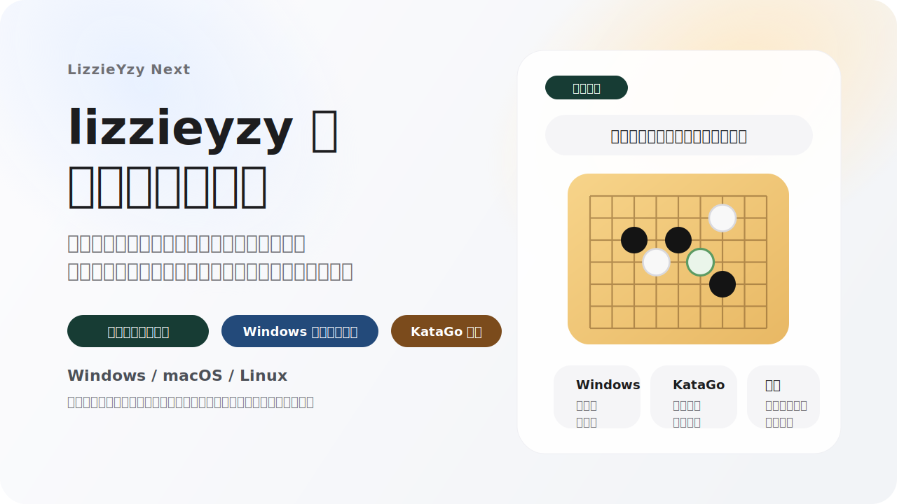

<p align="center">
  
</p>

<p align="center">
  <a href="https://github.com/wimi321/lizzieyzy-next/releases"></a>
  <a href="https://github.com/wimi321/lizzieyzy-next/actions/workflows/ci.yml"></a>
  <a href="LICENSE.txt"></a>
  
</p>

<p align="center">
  <a href="README.md">简体中文</a> · <a href="README_ZH_TW.md">繁體中文</a> · <a href="README_EN.md">English</a> · 日本語 · <a href="README_KO.md">한국어</a> · <a href="README_TH.md">ภาษาไทย</a>
</p>

<p align="center">
  <strong>LizzieYzy Next は継続保守されている KataGo 復盤デスクトップ GUI であり、<code>lizzieyzy 2.5.3</code> を土台にした現行メンテナンスラインです。</strong><br/>
  利用者が実際によく困る部分、つまり配布物の選び方、初回起動、野狐棋譜の取得、Windows の棋盤同期、そして全局レビューへ素早く入る流れを優先して整えています。
</p>

<p align="center">
  <a href="https://github.com/wimi321/lizzieyzy-next/releases"><strong>安定版をダウンロード</strong></a>
  ·
  <a href="docs/INSTALL_JA.md"><strong>インストールガイド</strong></a>
  ·
  <a href="docs/PACKAGES_EN.md"><strong>パッケージ一覧</strong></a>
  ·
  <a href="docs/TROUBLESHOOTING_EN.md"><strong>トラブル対応</strong></a>
  ·
  <a href="https://github.com/wimi321/lizzieyzy-next/discussions"><strong>Discussions</strong></a>
</p>

| プロジェクト状態 | 現在の値 |
| --- | --- |
| 利用者向けバージョン表記 | `LizzieYzy Next 1.0.0` |
| ベース | `lizzieyzy 2.5.3` |
| 既定エンジン | `KataGo v1.16.4` |
| 既定ウェイト | `kata1-zhizi-b28c512nbt-muonfd2.bin.gz` |
| 公式ダウンロード先 | GitHub Releases |

> [!IMPORTANT]
> 公式の公開ダウンロード先は現在 GitHub Releases のみです。
> 通常の Windows release には native `readboard.exe` が含まれており、`readboard_java` へのフォールバックは native ヘルパーが見つからない、または起動できない場合だけです。

## このプロジェクトを見る価値

- 一時的なパッチ分岐ではなく、`lizzieyzy` の実用ワークフローを継続保守する公開版です。
- ソースだけでなく、配布物、初回起動、release ページ、インストール文書、回帰確認まで含めて維持しています。
- 棋譜取得、SGF レビュー、勝率推移、全局解析、Windows 上での起動と同期といった実利用を優先しています。

## 現在の主な能力

| やりたいこと | 現在の体験 |
| --- | --- |
| ダウンロード後すぐ使い始めたい | Windows / macOS / Linux すべてに公開統合パッケージがあり、多くの利用者は先に環境を組む必要がありません |
| 最近の公開野狐棋譜を取りたい | 野狐のニックネームを入力するとアプリが自動でアカウントを解決します |
| Smart Optimize を使いたい | KataGo の benchmark ベースの流れで、進捗表示・中止・解析の一時停止と再開に対応します |
| Windows で棋盤同期を使いたい | 通常 release では native `readboard.exe` を優先し、必要時のみ Java 版に切り替えます |
| 棋譜読み込み中も早く操作したい | ローカル SGF や野狐読み込みでは先に操作を戻し、勝率の詳細は後から補完します |
| macOS に入れたい | 公式 DMG は release パイプラインで署名と公証を通します |

## どのパッケージを選ぶか

公開ダウンロードはすべて [GitHub Releases](https://github.com/wimi321/lizzieyzy-next/releases) にあります。まずは次の表だけ見れば十分です。

<p align="center">
  
</p>

| あなたの環境 | Releases で探すキーワード |
| --- | --- |
| Windows 利用者の多く、標準推奨 | `*windows64.opencl.portable.zip` |
| Windows、OpenCL が不安定、CPU フォールバック | `*windows64.with-katago.portable.zip` |
| Windows、NVIDIA GPU、より速さ重視 | `*windows64.nvidia.portable.zip` |
| Windows、自分でエンジン設定 | `*windows64.without.engine.portable.zip` |
| macOS Apple Silicon | `*mac-arm64.with-katago.dmg` |
| macOS Intel | `*mac-amd64.with-katago.dmg` |
| Linux | `*linux64.with-katago.zip` |

補足:

- Windows でインストーラ形式がよければ、対応する `*.installer.exe` も選べます。
- 公開されている 11 個の資産全体と内容は [docs/PACKAGES_EN.md](docs/PACKAGES_EN.md) を見てください。
- 通常の Windows release には native の棋盤同期ヘルパーが同梱されています。

## 現在の公開版ハイライト

- `Fox ニックネーム取得`
  数字のアカウント番号を前提にせず、野狐のニックネームから始められます。
- `KataGo Auto Setup`
  主な統合パッケージには `KataGo v1.16.4` と既定ウェイトが入り、Smart Optimize は benchmark ベースの調整と中止に対応します。
- `より強い Windows 同期経路`
  release パッケージに `readboard.exe` と依存ファイルを同梱し、必要なときだけ Java 版に戻します。
- `より直接的な棋譜読み込み体験`
  ダウンロード完了後はまず主ウィンドウを操作可能に戻し、勝率の細部はその後に補います。
- `より正式プロジェクトに近い release 運用`
  クロスプラットフォーム配布、CI、release notes、インストール文書を一体で管理しています。

## クイックスタート

1. [Releases](https://github.com/wimi321/lizzieyzy-next/releases) から自分の環境に合うパッケージを取得します。
2. Windows の内蔵 KataGo 版を使う場合は、`KataGo Auto Setup` で `Smart Optimize` を一度実行します。
3. ローカル SGF を開くか、野狐ニックネーム取得フローから最近の公開棋譜を読み込みます。
4. グラフ、`Down`、キーボード操作で重要局面を追いながら、残りのレビュー情報が埋まるのを待ちます。

<p align="center">
  <a href="assets/fox-id-demo.gif">
    
  </a>
</p>

## 画面プレビュー

<p align="center">
  
</p>

<p align="center">
  
</p>

現在の画面は次の 3 層で見るとわかりやすいです。

- 盤面エリア: 現局面、候補手、局所読み。
- 勝率グラフ: 全局の流れと大きな転換点。
- 下部クイック概要: 全手を追う前に、どこから見返すべきかを先に教えてくれます。

## ドキュメントとコミュニティ

- [インストールガイド](docs/INSTALL_JA.md)
- [パッケージ一覧](docs/PACKAGES_EN.md)
- [トラブル対応](docs/TROUBLESHOOTING_EN.md)
- [検証済みプラットフォーム](docs/TESTED_PLATFORMS.md)
- [変更履歴](CHANGELOG.md)
- [ロードマップ](ROADMAP.md)
- [コントリビュート](CONTRIBUTING.md)
- [サポート](SUPPORT.md)
- [GitHub Discussions](https://github.com/wimi321/lizzieyzy-next/discussions)
- 中国語 QQ グループ: `299419120`

## ソースからビルド

必要なもの:

- JDK 17
- Maven 3.9+

ビルドコマンド:

```bash
mvn test
mvn -DskipTests package
java -jar target/lizzie-yzy2.5.3-shaded.jar
```

パッケージング、release、運用自動化まで扱う場合は次も参照してください。

- [docs/DEVELOPMENT_EN.md](docs/DEVELOPMENT_EN.md)
- [docs/MAINTENANCE_EN.md](docs/MAINTENANCE_EN.md)
- [docs/RELEASE_CHECKLIST.md](docs/RELEASE_CHECKLIST.md)

## 謝辞

- Original project: [yzyray/lizzieyzy](https://github.com/yzyray/lizzieyzy)
- KataGo: [lightvector/KataGo](https://github.com/lightvector/KataGo)
- Historical Fox sync references: [yzyray/FoxRequest](https://github.com/yzyray/FoxRequest), [FuckUbuntu/Lizzieyzy-Helper](https://github.com/FuckUbuntu/Lizzieyzy-Helper)

## ライセンス

本プロジェクトは [GPL-3.0](LICENSE.txt) の下で公開されています。
