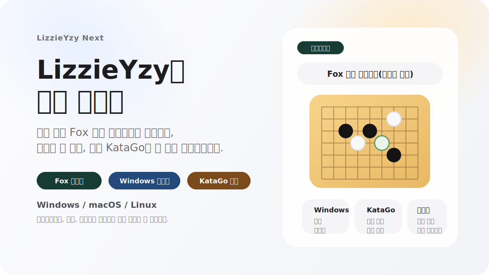
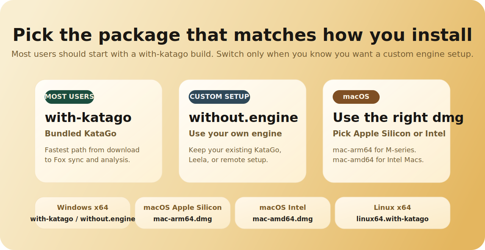

<p align="center">
  
</p>

<p align="center">
  <a href="https://github.com/wimi321/lizzieyzy-next/releases"></a>
  <a href="https://github.com/wimi321/lizzieyzy-next/actions/workflows/ci.yml"></a>
  <a href="LICENSE.txt"></a>
  
</p>

<p align="center">
  <a href="README.md">简体中文</a> · <a href="README_ZH_TW.md">繁體中文</a> · <a href="README_EN.md">English</a> · <a href="README_JA.md">日本語</a> · 한국어 · <a href="README_TH.md">ภาษาไทย</a>
</p>

<p align="center">
  <strong>LizzieYzy Next 는 계속 유지보수되는 KataGo 복기용 데스크톱 GUI 이며, <code>lizzieyzy 2.5.3</code> 를 이어가는 현재 메인 유지보수 라인입니다.</strong><br/>
  실제 사용자가 자주 부딪히는 문제, 즉 패키지 선택, 첫 실행, Fox 기보 가져오기, Windows 바둑판 동기화, 그리고 전판 복기 흐름으로 빨리 들어가는 경험을 우선해서 다듬고 있습니다.
</p>

<p align="center">
  <a href="https://github.com/wimi321/lizzieyzy-next/releases"><strong>안정판 다운로드</strong></a>
  ·
  <a href="docs/INSTALL_KO.md"><strong>설치 가이드</strong></a>
  ·
  <a href="docs/PACKAGES_EN.md"><strong>패키지 안내</strong></a>
  ·
  <a href="docs/TROUBLESHOOTING_EN.md"><strong>문제 해결</strong></a>
  ·
  <a href="https://github.com/wimi321/lizzieyzy-next/discussions"><strong>Discussions</strong></a>
</p>

| 프로젝트 상태 | 현재 값 |
| --- | --- |
| 사용자 표시 버전 라인 | `LizzieYzy Next 1.0.0` |
| 기반 버전 | `lizzieyzy 2.5.3` |
| 기본 엔진 | `KataGo v1.16.4` |
| 기본 가중치 | `kata1-zhizi-b28c512nbt-muonfd2.bin.gz` |
| 공식 다운로드 경로 | GitHub Releases |

> [!IMPORTANT]
> 공식 공개 다운로드 경로는 이제 GitHub Releases 하나로 통일되었습니다.
> 일반 Windows release 는 native `readboard.exe` 를 포함하며, `readboard_java` 로의 fallback 은 native helper 가 없거나 시작하지 못할 때만 사용됩니다.

## 왜 이 프로젝트를 볼 가치가 있는가

- 일회성 패치 브랜치가 아니라, `lizzieyzy` 의 실사용 흐름을 계속 유지보수하는 공개 버전입니다.
- 소스 코드만 고치는 것이 아니라 배포판, 첫 실행 경험, release 페이지, 설치 문서, 회귀 점검까지 함께 관리합니다.
- 기보 가져오기, SGF 복기, 승률 추세 확인, 전판 분석, Windows 에서의 실행과 동기화 같은 실제 사용을 우선합니다.

## 현재 핵심 기능

| 하고 싶은 일 | 지금의 경험 |
| --- | --- |
| 다운로드 후 빨리 시작하기 | Windows, macOS, Linux 모두 공개 통합 패키지를 제공하므로 대부분의 사용자는 환경을 먼저 조립할 필요가 없습니다 |
| 최근 공개 Fox 기보 가져오기 | Fox 닉네임을 입력하면 앱이 계정을 자동으로 찾아 줍니다 |
| Smart Optimize 사용하기 | KataGo benchmark 기반 흐름으로 진행되며, 진행 표시, 취소, 분석 일시정지와 복구를 지원합니다 |
| Windows 에서 바둑판 동기화 사용하기 | 일반 release 는 native `readboard.exe` 를 우선 사용하고 필요할 때만 Java helper 로 돌아갑니다 |
| 기보 로딩 중에도 빨리 조작하기 | 로컬 SGF 와 Fox 로딩은 먼저 조작권을 돌려주고, 승률 세부 정보는 뒤에서 계속 채웁니다 |
| macOS 에 설치하기 | 공식 DMG 는 release 파이프라인에서 서명과 공증을 거칩니다 |

## 어떤 패키지를 받아야 하나

공개 다운로드는 모두 [GitHub Releases](https://github.com/wimi321/lizzieyzy-next/releases) 에 있습니다. 먼저는 아래 표만 보면 충분합니다.

<p align="center">
  
</p>

| 내 상황 | Releases 에서 찾을 키워드 |
| --- | --- |
| 대부분의 Windows 사용자, 기본 추천 | `*windows64.opencl.portable.zip` |
| Windows, OpenCL 이 불안정, CPU 대안 | `*windows64.with-katago.portable.zip` |
| Windows, NVIDIA GPU, 더 빠른 속도 원함 | `*windows64.nvidia.portable.zip` |
| Windows, 엔진을 직접 설정 | `*windows64.without.engine.portable.zip` |
| macOS Apple Silicon | `*mac-arm64.with-katago.dmg` |
| macOS Intel | `*mac-amd64.with-katago.dmg` |
| Linux | `*linux64.with-katago.zip` |

참고:

- 설치형이 더 편한 Windows 사용자는 대응되는 `*.installer.exe` 를 선택할 수 있습니다.
- 공개된 11개 자산 전체와 구성은 [docs/PACKAGES_EN.md](docs/PACKAGES_EN.md) 에 정리되어 있습니다.
- 일반 Windows release 에는 native 바둑판 동기화 helper 가 이미 포함되어 있습니다.

## 현재 공개판 핵심 포인트

- `Fox 닉네임으로 기보 가져오기`
  숫자 계정 번호를 일반 사용자 전제 조건으로 두지 않고, 바로 닉네임부터 시작할 수 있습니다.
- `KataGo Auto Setup`
  메인 통합 패키지는 `KataGo v1.16.4` 와 기본 가중치를 포함하고, Smart Optimize 는 benchmark 기반 튜닝과 취소를 지원합니다.
- `더 강한 Windows 동기화 경로`
  release 패키지에 `readboard.exe` 와 의존 파일을 함께 넣고, 꼭 필요할 때만 Java 판으로 돌아갑니다.
- `더 직접적인 기보 로딩 상호작용`
  다운로드가 끝나면 먼저 메인 창 조작을 되돌리고, 승률 세부 정보는 뒤에서 계속 채워 넣습니다.
- `더 정식 프로젝트다운 release 운영`
  크로스 플랫폼 패키징, CI, release notes, 설치 문서를 제품의 일부로 유지합니다.

## 빠르게 시작하기

1. [Releases](https://github.com/wimi321/lizzieyzy-next/releases) 에서 시스템에 맞는 패키지를 받습니다.
2. Windows 내장 KataGo 번들을 사용한다면 `KataGo Auto Setup` 에서 `Smart Optimize` 를 한 번 실행합니다.
3. 로컬 SGF 를 열거나, Fox 닉네임 가져오기 흐름으로 최근 공개 기보를 불러옵니다.
4. 그래프, `Down`, 키보드 이동으로 중요한 장면을 먼저 보고, 나머지 복기 정보가 채워지는 것을 기다립니다.

<p align="center">
  <a href="assets/fox-id-demo.gif">
    
  </a>
</p>

## 화면 미리보기

<p align="center">
  
</p>

<p align="center">
  
</p>

현재 화면은 세 층의 정보로 이해하면 편합니다.

- 바둑판 영역: 현재 형세, 추천점, 부분 읽기.
- 승률 그래프: 전판 추세와 큰 전환점.
- 하단 빠른 개요: 모든 수를 보기 전에 어디부터 다시 볼지 먼저 알려 줍니다.

## 문서와 커뮤니티

- [설치 가이드](docs/INSTALL_KO.md)
- [패키지 안내](docs/PACKAGES_EN.md)
- [문제 해결](docs/TROUBLESHOOTING_EN.md)
- [검증된 플랫폼](docs/TESTED_PLATFORMS.md)
- [변경 기록](CHANGELOG.md)
- [로드맵](ROADMAP.md)
- [기여하기](CONTRIBUTING.md)
- [지원](SUPPORT.md)
- [GitHub Discussions](https://github.com/wimi321/lizzieyzy-next/discussions)
- 중국어 QQ 그룹: `299419120`

## 소스에서 빌드하기

필요 사항:

- JDK 17
- Maven 3.9+

빌드 명령:

```bash
mvn test
mvn -DskipTests package
java -jar target/lizzie-yzy2.5.3-shaded.jar
```

패키징, release, 자동화 흐름까지 다룰 예정이라면 아래 문서도 참고하세요.

- [docs/DEVELOPMENT_EN.md](docs/DEVELOPMENT_EN.md)
- [docs/MAINTENANCE_EN.md](docs/MAINTENANCE_EN.md)
- [docs/RELEASE_CHECKLIST.md](docs/RELEASE_CHECKLIST.md)

## 크레딧

- Original project: [yzyray/lizzieyzy](https://github.com/yzyray/lizzieyzy)
- KataGo: [lightvector/KataGo](https://github.com/lightvector/KataGo)
- Historical Fox sync references: [yzyray/FoxRequest](https://github.com/yzyray/FoxRequest), [FuckUbuntu/Lizzieyzy-Helper](https://github.com/FuckUbuntu/Lizzieyzy-Helper)

## 라이선스

이 프로젝트는 [GPL-3.0](LICENSE.txt) 라이선스로 배포됩니다.
