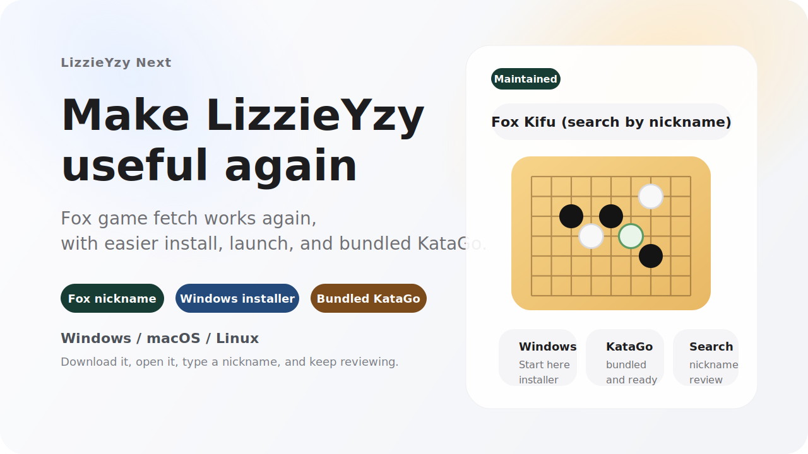

  

  
  
  
  

  <a href="README.md">简体中文</a> · <a href="README_ZH_TW.md">繁體中文</a> · <a href="README_EN.md">English</a> · <a href="README_JA.md">日本語</a> · <a href="README_KO.md">한국어</a> · ภาษาไทย

  <strong>LizzieYzy Next คือเวอร์ชันที่ดูแลต่อของ lizzieyzy ซึ่งเป็นเครื่องมือ GUI สำหรับทบทวนเกมโกะด้วย KataGo สำหรับผู้เล่นทั่วไป</strong> 
  โปรเจกต์นี้ปรับปรุงประสบการณ์หลักใหม่ทั้งหมด: แพ็กเกจดาวน์โหลดที่เลือกง่ายขึ้น, การเริ่มต้นครั้งแรกที่ลื่นไหล, การดึงเกมจาก Fox (野狐) ที่ใช้งานได้ และมุมมองวิเคราะห์เกมทั้งกระดานที่เข้าใจง่ายกว่าเดิม 
  <strong>ดาวน์โหลดและติดตั้ง ใส่ชื่อเล่น Fox ดึงเกมสาธารณะล่าสุด รันการวิเคราะห์ทั้งกระดานอย่างรวดเร็ว จากนั้นใช้กราฟอัตราชนะและภาพรวมด้านล่างเพื่อหาจังหวะสำคัญทันที</strong>

  <a href="https://github.com/wimi321/lizzieyzy-next/releases"><strong>ดาวน์โหลดรีลีส</strong></a>
  ·
  <a href="docs/INSTALL.md"><strong>คู่มือติดตั้ง</strong></a>
  ·
  <a href="docs/TROUBLESHOOTING.md"><strong>คำถามที่พบบ่อย</strong></a>

> [!IMPORTANT]
> ถ้าคุณแค่อยากดาวน์โหลดเวอร์ชันที่ใช่ ให้จำ 6 ข้อนี้:
> - ผู้ใช้ Windows ส่วนใหญ่: ไปที่ [Releases](https://github.com/wimi321/lizzieyzy-next/releases) แล้วดาวน์โหลด `*windows64.opencl.portable.zip`
> - ถ้าคุณมีการ์ดจอ NVIDIA และต้องการความเร็วสูงกว่า: ดาวน์โหลด `*windows64.nvidia.portable.zip`
> - ถ้า OpenCL ไม่เสถียรบนเครื่องของคุณ: ดาวน์โหลด `*windows64.with-katago.portable.zip`
> - ตอนนี้รองรับการใส่ชื่อเล่น Fox โดยตรงเพื่อดึงเกมสาธารณะล่าสุด ไม่ต้องรู้เลขบัญชีก่อน
> - แพ็กเกจแนะนำมาพร้อม KataGo `v1.16.4` และน้ำหนักที่แนะนำอย่างเป็นทางการ `zhizi` (`kata1-zhizi-b28c512nbt-muonfd2.bin.gz`)
> - แพ็กเกจหลักมาพร้อม `readboard_java` ผู้ใช้ส่วนใหญ่ไม่ต้องไปหา readboard แยกอีก

## ทำไมหลายคนเลือกโปรเจกต์นี้

`LizzieYzy Next` สามารถเข้าใจได้ว่า:

- เครื่องมือ `KataGo ทบทวนเกมโกะบนเดสก์ท็อป` ที่ยังดูแลอย่างต่อเนื่อง
- เวิร์กโฟลว์ที่รวม `ดึงเกมจาก Fox + การวิเคราะห์ทั้งกระดานรวดเร็ว + แพ็กเกจหลายแพลตฟอร์ม` เข้าด้วยกัน
- สาขาที่ดูแลต่อเพื่อให้ผู้ใช้ `lizzieyzy` เก่าใช้งานได้อย่างต่อเนื่อง

## เปิดแล้วทำอะไรได้ทันที

| คุณต้องการทำอะไร | โปรเจกต์นี้จัดการอย่างไร |
| --- | --- |
| ดึงเกม Fox สาธารณะล่าสุด | ใส่ชื่อเล่น Fox โดยตรง โปรแกรมจะจับคู่บัญชีและดึงเกมให้ |
| ดูแนวโน้มทั้งกระดานอย่างรวดเร็ว | การวิเคราะห์ทั้งกระดานรวดเร็ว ไม่ต้องคลิกทีละหมาก |
| ค้นหาจังหวะสำคัญอย่างรวดเร็ว | กราฟอัตราชนะใหม่และภาพรวม heatmap ด้านล่าง เห็นปัญหาใหญ่ได้ทันที |
| การตั้งค่าน้อย | แพ็กเกจแนะนำมาพร้อม KataGo, น้ำหนักเริ่มต้น และ auto setup ครั้งแรก |
| ไม่อยากติดตั้ง | Windows แนะนำแพ็กเกจ `portable.zip` ก่อน |
| ซิงก์กระดาน | แพ็กเกจหลักมาพร้อม `readboard_java` |

## เลือกดาวน์โหลดตัวไหน

ดาวน์โหลดทั้งหมดอยู่ใน [Releases](https://github.com/wimi321/lizzieyzy-next/releases)

| สถานการณ์ของคุณ | คีย์เวิร์ดไฟล์ที่ควรหา |
| --- | --- |
| ผู้ใช้ Windows ส่วนใหญ่ (แนะนำ, portable) | `*windows64.opencl.portable.zip` |
| Windows, OpenCL, ต้องการตัวติดตั้ง | `*windows64.opencl.installer.exe` |
| Windows, OpenCL ไม่เสถียร, ใช้ CPU, portable | `*windows64.with-katago.portable.zip` |
| Windows, การ์ดจอ NVIDIA, ต้องการความเร็ว, portable | `*windows64.nvidia.portable.zip` |
| Windows, ตั้งค่าเอนจินเอง, portable | `*windows64.without.engine.portable.zip` |
| macOS Apple Silicon | `*mac-apple-silicon.with-katago.dmg` |
| macOS Intel | `*mac-intel.with-katago.dmg` |
| Linux | `*linux64.with-katago.zip` |

## เริ่มต้นใน 3 ขั้นตอน

1. ไปที่ [Releases](https://github.com/wimi321/lizzieyzy-next/releases) และดาวน์โหลดแพ็กเกจที่เหมาะกับระบบของคุณ
2. เปิดโปรแกรมแล้วคลิก `Fox` เพื่อใส่ชื่อเล่น Fox
3. หลังจากดึงเกมแล้ว ให้รันการวิเคราะห์ทั้งกระดานรวดเร็ว ใช้กราฟอัตราชนะและภาพรวมด้านล่างเพื่อหาจังหวะสำคัญ

## เครดิต

- โปรเจกต์ดั้งเดิม: [yzyray/lizzieyzy](https://github.com/yzyray/lizzieyzy)
- KataGo: [lightvector/KataGo](https://github.com/lightvector/KataGo)
อ้างอิงประวัติการดึงเกม Fox:
- [yzyray/FoxRequest](https://github.com/yzyray/FoxRequest)
- [FuckUbuntu/Lizzieyzy-Helper](https://github.com/FuckUbuntu/Lizzieyzy-Helper)

## การแปล

ยินดีรับการแปล! ถ้าคุณต้องการแปล README นี้เป็นภาษาแม่ของคุณ โปรดส่ง Pull Request ได้เลย

We welcome translations! If you want to translate this README into your native language, please feel free to submit a Pull Request.
