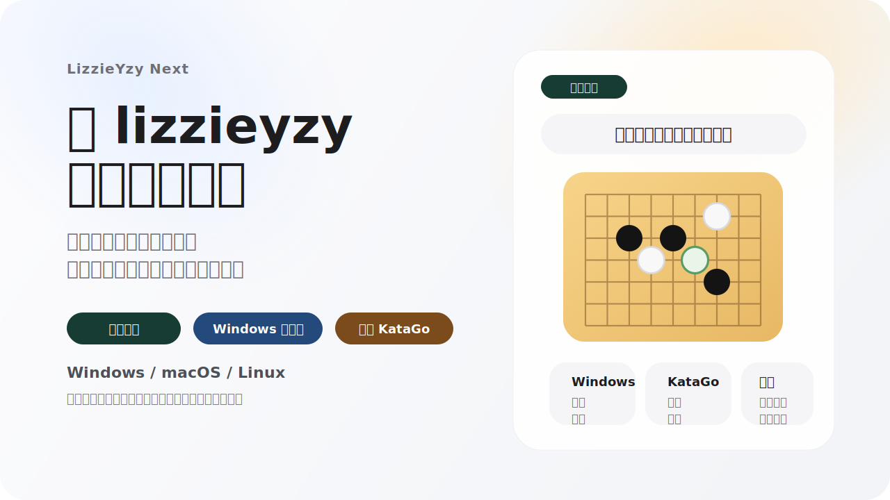

  

  
  
  
  

  <a href="README.md">简体中文</a> · 繁體中文 · <a href="README_EN.md">English</a> · <a href="README_JA.md">日本語</a> · <a href="README_KO.md">한국어</a> · <a href="README_TH.md">ภาษาไทย</a>

  <strong>LizzieYzy Next 是目前仍持續維護的 lizzieyzy 維護版，也是一個面向一般棋友的 KataGo 圍棋覆盤 GUI。</strong> 
  它把真正影響體驗的幾件事重新打磨了一遍：更好挑的下載包、更省心的首次啟動、持續可用的野狐抓譜，以及更容易看懂的整盤分析視角。 
  <strong>下載安裝，輸入野狐暱稱，抓最近公開棋譜,跑快速全盤分析，再用新版勝率圖和底部快速概覽快速定位關鍵手。</strong>

  <a href="https://github.com/wimi321/lizzieyzy-next/releases"><strong>下載發佈包</strong></a>
  ·
  <a href="docs/INSTALL.md"><strong>安裝說明</strong></a>
  ·
  <a href="docs/TROUBLESHOOTING.md"><strong>常見問題</strong></a>

> [!TIP]
> 專案討論 QQ 群：`299419120`
>
> 歡迎交流使用問題、回報 bug、分享使用體驗，或者討論接下來最想加的功能。

> [!IMPORTANT]
> 如果你只想先下對版本，先記住這 6 句：
> - Windows 大多數使用者：到 [Releases](https://github.com/wimi321/lizzieyzy-next/releases) 下載 `*windows64.opencl.portable.zip`
> - 如果你的電腦有 NVIDIA 顯示卡並且想更快：下載 `*windows64.nvidia.portable.zip`
> - 如果 OpenCL 在你的電腦上不穩定：下載 `*windows64.with-katago.portable.zip`
> - 現在支援直接輸入野狐暱稱抓最近公開棋譜，不需要先查帳號數字
> - 主推薦整合包已內建 KataGo `v1.16.4` 和官方推薦 `zhizi` 權重 `kata1-zhizi-b28c512nbt-muonfd2.bin.gz`
> - 主發佈包已內建 `readboard_java`，多數使用者不需要再單獨找 readboard 倉庫

## 為什麼很多使用者會直接選它

`LizzieYzy Next` 可以直接理解成：

- 一套還在持續維護的 `KataGo 圍棋覆盤桌面工具`
- 一條把 `野狐抓譜 + 快速全盤分析 + 多平台發佈包` 串起來的實用工作流
- 一個讓老 `lizzieyzy` 使用者更容易繼續用下去的維護分支

## 你打開後馬上能做什麼

| 你想做什麼 | 這個專案現在怎麼解決 |
| --- | --- |
| 抓最近公開野狐棋譜 | 直接輸入野狐暱稱，程式自動匹配帳號並抓譜 |
| 快速看整盤走勢 | 提供快速全盤分析，不用完全靠一步一步手點 |
| 快速找問題手 | 提供新版主勝率圖和底部熱力概覽，更容易一眼看出大問題手 |
| 少折騰設定 | 推薦整合包已內建 KataGo、預設權重和首次自動設定 |
| 不想安裝 | Windows 預設優先推薦 `portable.zip` 免安裝包 |
| 做棋盤同步 | 主發佈包已內建 `readboard_java` 簡易同步工具 |

## 先下載哪個

所有下載都在 [Releases](https://github.com/wimi321/lizzieyzy-next/releases)。

| 你的情況 | 到 Releases 裡找包含這個關鍵字的檔案 |
| --- | --- |
| Windows 大多數使用者，推薦，免安裝 | `*windows64.opencl.portable.zip` |
| Windows，OpenCL 版，想安裝 | `*windows64.opencl.installer.exe` |
| Windows，OpenCL 不穩定，CPU 相容兜底，免安裝 | `*windows64.with-katago.portable.zip` |
| Windows，NVIDIA 顯示卡，想更快，免安裝 | `*windows64.nvidia.portable.zip` |
| Windows，自己設定引擎，免安裝 | `*windows64.without.engine.portable.zip` |
| macOS Apple Silicon | `*mac-apple-silicon.with-katago.dmg` |
| macOS Intel | `*mac-intel.with-katago.dmg` |
| Linux | `*linux64.with-katago.zip` |

## 三步開始

1. 到 [Releases](https://github.com/wimi321/lizzieyzy-next/releases) 下載適合自己系統的包。
2. 打開程式後，點擊 `野狐棋譜`，輸入野狐暱稱。
3. 抓到棋譜後繼續做快速全盤分析，用主勝率圖和底部快速概覽直接定位關鍵手。

## 致謝

- 原專案：[yzyray/lizzieyzy](https://github.com/yzyray/lizzieyzy)
- KataGo：[lightvector/KataGo](https://github.com/lightvector/KataGo)
野狐抓譜歷史參考：
- [yzyray/FoxRequest](https://github.com/yzyray/FoxRequest)
- [FuckUbuntu/Lizzieyzy-Helper](https://github.com/FuckUbuntu/Lizzieyzy-Helper)

## 參與翻譯

歡迎提供翻譯！如果您願意將本說明翻譯成您的母語，請隨時提交 PR。

We welcome translations! If you want to translate this README into your native language, please feel free to submit a Pull Request.
