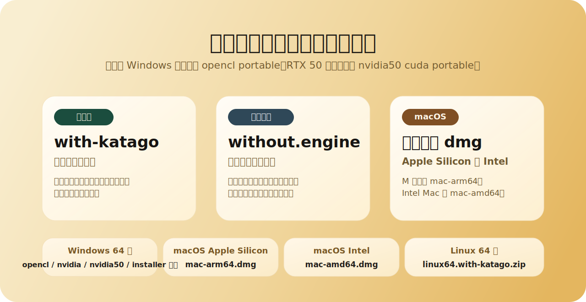

<p align="center">
  
</p>

<p align="center">
  <a href="https://github.com/wimi321/lizzieyzy-next/releases"></a>
  <a href="https://github.com/wimi321/lizzieyzy-next/actions/workflows/ci.yml"></a>
  <a href="LICENSE.txt"></a>
  
</p>

<p align="center">
  <a href="README.md">简体中文</a> · 繁體中文 · <a href="README_EN.md">English</a> · <a href="README_JA.md">日本語</a> · <a href="README_KO.md">한국어</a> · <a href="README_TH.md">ภาษาไทย</a>
</p>

<p align="center">
  <strong>LizzieYzy Next 是一個持續維護的 KataGo 圍棋覆盤桌面 GUI，也是 <code>lizzieyzy 2.5.3</code> 的延續維護線。</strong><br/>
  它優先處理真實使用者最常遇到的事情：下載包怎麼選、第一次啟動怎麼更省心、野狐棋譜怎麼更快抓到、Windows 同步工具怎麼隨包可用，以及整盤覆盤怎麼更快進入狀態。
</p>

<p align="center">
  <a href="https://github.com/wimi321/lizzieyzy-next/releases"><strong>下載正式版本</strong></a>
  ·
  <a href="docs/INSTALL.md"><strong>安裝指南</strong></a>
  ·
  <a href="docs/PACKAGES.md"><strong>發佈包說明</strong></a>
  ·
  <a href="docs/TROUBLESHOOTING.md"><strong>常見問題</strong></a>
  ·
  <a href="https://github.com/wimi321/lizzieyzy-next/discussions"><strong>Discussions</strong></a>
</p>

| 專案狀態 | 目前說明 |
| --- | --- |
| 使用者可見版本線 | `LizzieYzy Next 1.0.0` |
| 上游基礎 | `lizzieyzy 2.5.3` |
| 預設引擎 | `KataGo v1.16.4` |
| 預設權重 | `kata1-zhizi-b28c512nbt-muonfd2.bin.gz` |
| 官方下載入口 | GitHub Releases |

> [!IMPORTANT]
> 官方公開下載入口現在只保留 GitHub Releases。
> Windows 正常 release 已內建原生 `readboard.exe`；只有 native 缺失或啟動失敗時才回退到 `readboard_java`，不需要再單獨找同步工具倉庫。

## 為什麼這個專案值得看

- 它不是一次性的補丁分支，而是持續維護 `lizzieyzy` 主使用鏈路的公開版本。
- 它不只改原始碼，也一起維護安裝包、首次啟動、發佈頁、安裝文件和回歸驗證。
- 它優先服務真實使用場景：抓譜、覆盤、看勝率圖、做整盤分析、在 Windows 上完成同步與啟動。

## 目前核心能力

| 你想做什麼 | 目前體驗 |
| --- | --- |
| 下載後盡快開始用 | Windows、macOS、Linux 都提供公開整合包，多數使用者不用先拼環境 |
| 抓最近公開野狐棋譜 | 直接輸入野狐暱稱，程式會自動匹配帳號並取得公開棋譜 |
| 做智能測速優化 | 依據 KataGo 官方 benchmark 思路執行，過程可見、可中止，並會暫停後恢復分析 |
| 在 Windows 上做棋盤同步 | 正常 release 預設使用原生 `readboard.exe`，必要時才回退 Java 簡易版 |
| 載入棋譜後盡快能操作 | 本地 SGF 與野狐載入會優先恢復主視窗可操作狀態，勝率細節再繼續補齊 |
| 在 macOS 上安裝 | 官方 DMG 發佈流程已接入簽名與公證 |

## 下載哪個包

所有公開下載都在 [GitHub Releases](https://github.com/wimi321/lizzieyzy-next/releases)。如果你只想先下對版本，按下面選就夠了。

<p align="center">
  
</p>

| 你的情況 | 到 Releases 裡找包含這個關鍵字的檔案 |
| --- | --- |
| Windows 大多數使用者，預設推薦 | `*windows64.opencl.portable.zip` |
| Windows，OpenCL 不穩定，CPU 相容兜底 | `*windows64.with-katago.portable.zip` |
| Windows，NVIDIA 顯示卡，希望更快 | `*windows64.nvidia.portable.zip` |
| Windows，自己配置引擎 | `*windows64.without.engine.portable.zip` |
| macOS Apple Silicon | `*mac-arm64.with-katago.dmg` |
| macOS Intel | `*mac-amd64.with-katago.dmg` |
| Linux | `*linux64.with-katago.zip` |

說明：

- 想保留安裝流程的 Windows 使用者，也可以選同系列的 `*.installer.exe`。
- 想看完整 11 個公開資產與每個包裡帶了什麼，直接看 [docs/PACKAGES.md](docs/PACKAGES.md)。
- Windows 正常 release 已內建棋盤同步所需的 native `readboard`。

## 目前公開版重點

- `Fox 暱稱抓譜`
  直接輸入野狐暱稱，不再把「先查帳號數字」當成普通使用者前置步驟。
- `KataGo 一鍵設定`
  主整合包內建 `KataGo v1.16.4` 與預設權重，智能測速優化依 benchmark 流程執行，並支援中止。
- `更穩的 Windows 同步鏈路`
  發佈包隨包內建 `readboard.exe` 與依賴，必要時才回退 Java 版。
- `更直接的棋譜載入互動`
  下載完成後優先恢復主視窗可操作狀態，使用者可以先繼續看譜，勝率曲線再補齊。
- `更像正式桌面專案的發佈方式`
  跨平台打包、CI、release notes 和安裝文件都納入維護。

## 快速上手

1. 到 [Releases](https://github.com/wimi321/lizzieyzy-next/releases) 下載適合自己系統的包。
2. 如果你使用的是內建 KataGo 的 Windows 版本，可以先在 `KataGo 一鍵設定` 裡執行一次「智能測速優化」。
3. 直接打開本地 SGF，或從野狐暱稱流程取得最近公開棋譜。
4. 用方向鍵、`Down` 和主勝率圖快速瀏覽關鍵手，其他覆盤資料會繼續補齊。

<p align="center">
  <a href="assets/fox-id-demo-cn.gif">
    
  </a>
</p>

## 介面預覽

<p align="center">
  
</p>

<p align="center">
  
</p>

你可以把現在的介面理解成三層資訊：

- 主棋盤區：看目前局面、推薦點與局部閱讀。
- 勝率圖：快速看整盤走勢與轉折點。
- 底部快速概覽：先找到最值得回看的區段，再決定是否細看每一手。

## 文件與社群

- [安裝指南](docs/INSTALL.md)
- [發佈包說明](docs/PACKAGES.md)
- [常見問題與排錯](docs/TROUBLESHOOTING.md)
- [已驗證平台](docs/TESTED_PLATFORMS.md)
- [更新日誌](CHANGELOG.md)
- [專案路線圖](ROADMAP.md)
- [參與貢獻](CONTRIBUTING.md)
- [取得幫助](SUPPORT.md)
- [GitHub Discussions](https://github.com/wimi321/lizzieyzy-next/discussions)
- QQ 群：`299419120`

## 從原始碼建置

需求：

- JDK 17
- Maven 3.9+

建置命令：

```bash
mvn test
mvn -DskipTests package
java -jar target/lizzie-yzy2.5.3-shaded.jar
```

如果你準備繼續維護打包、發佈或自動化流程，建議再看：

- [docs/DEVELOPMENT.md](docs/DEVELOPMENT.md)
- [docs/MAINTENANCE.md](docs/MAINTENANCE.md)
- [docs/RELEASE_CHECKLIST.md](docs/RELEASE_CHECKLIST.md)

## 致謝

- 原專案：[yzyray/lizzieyzy](https://github.com/yzyray/lizzieyzy)
- KataGo：[lightvector/KataGo](https://github.com/lightvector/KataGo)
- 野狐抓譜歷史參考：[yzyray/FoxRequest](https://github.com/yzyray/FoxRequest)、[FuckUbuntu/Lizzieyzy-Helper](https://github.com/FuckUbuntu/Lizzieyzy-Helper)

## 授權

本專案採用 [GPL-3.0](LICENSE.txt)。
