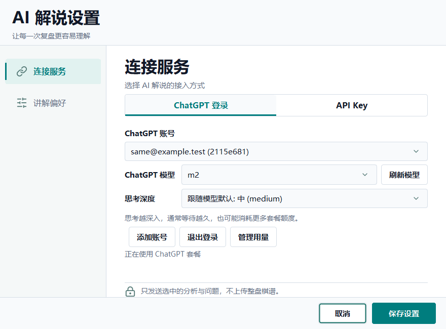
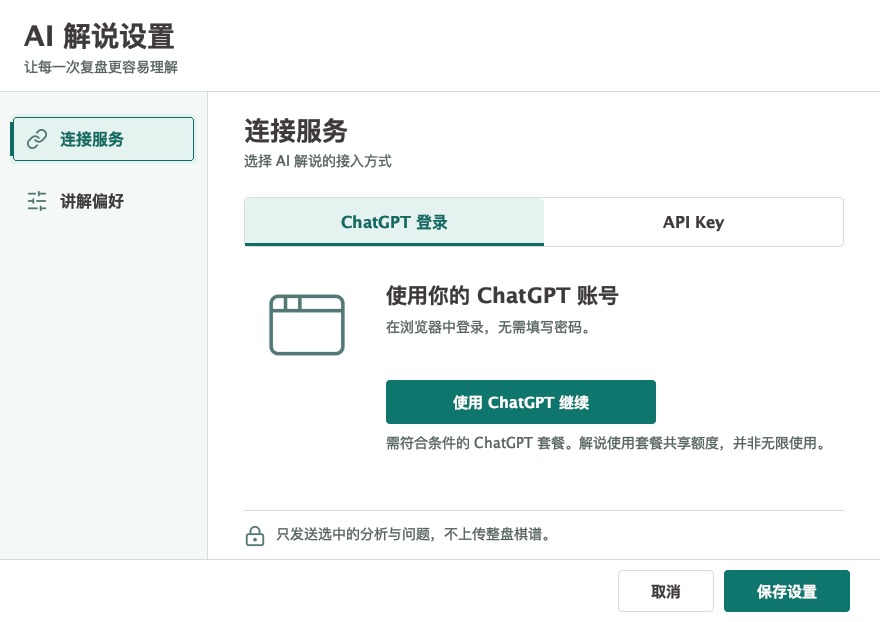
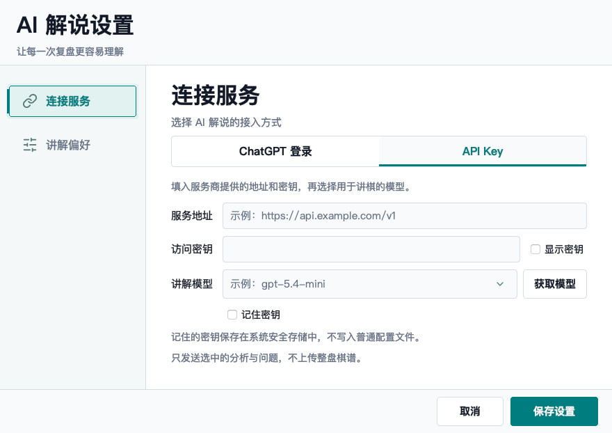
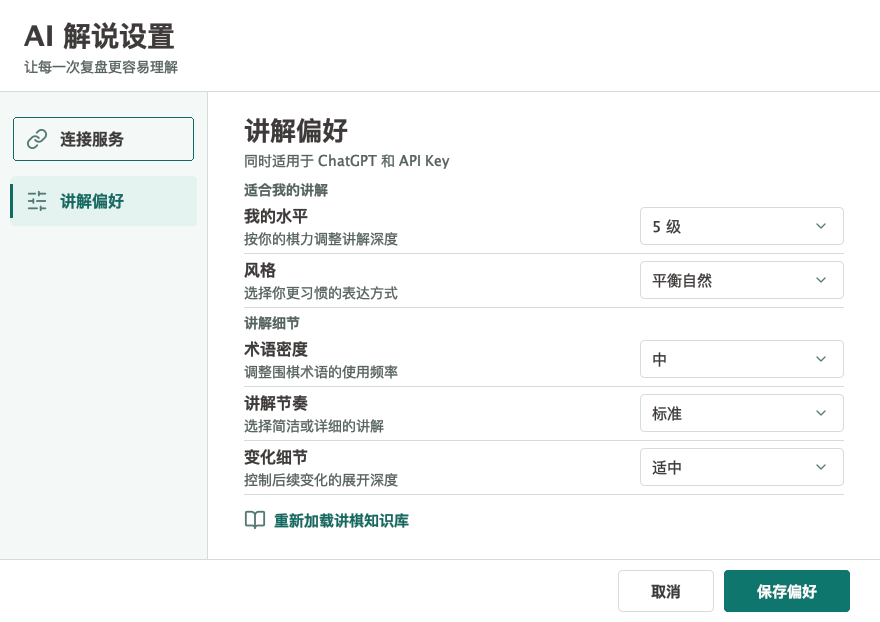

# AI commentary: ChatGPT sign-in and API keys

## 中文使用说明

首次打开时，点击 **连接 AI** 完成连接。之后选择 **下一手 / 区间 / 整局**，
再点击 **开始解说**；选择模式本身不会发送请求或消耗额度。
只有区间模式显示起止手数。尚无分析时，先在棋盘上开启分析，看到推荐落点后再解说。

追问针对窗口正在展示的解说；在棋盘上浏览其他手数，不会把追问结果写到另一手。
想讲新局面时，回到 **下一手** 并点击 **开始解说**。取消设置、停止或网络失败会保留
尚未完成的追问，便于修改后重试。切换到另一盘棋会结束旧请求并清空旧问题。
解说加入棋谱评论后，仍需保存棋谱文件；中途断流的半截结果不会写入棋谱。

打开 **AI 解说 → 设置 → 连接服务**，在并列的 **ChatGPT 登录 / API Key** 中自行选择。
ChatGPT 登录通过系统浏览器完成，软件不收集密码；登录并授权后选择模型并保存。
模型旁的 **思考深度** 只展示当前账号目录中该模型支持的档位。
**跟随模型默认** 会显示接口公布的具体档位，例如 **跟随模型默认: 中 (medium)**。
开始解说时重新读取当前账号的模型默认值并发送该档位，不会将它保存成固定的手动选择。
接口没有公布有效默认档位时，显示 **模型默认（未公布）** 并省略强度参数，不猜测档位。
档位与 Codex 的标准值对应：低 `low`、中 `medium`、高 `high`、超高 `xhigh`、
最大 `max`、极限 `ultra`；本地化名称旁保留标准标识，不会为模型补上不支持的档位。
思考越深入，通常等待越久，也可能消耗更多套餐额度；每个账号与模型分别记住选择。



两种方式分别保留配置，切换不会清除另一种方式的凭据，也不会自动切换计费方式。
KataGo 仍负责棋局计算，ChatGPT 只根据分析证据讲解；套餐资格和共享额度以 OpenAI 为准。
额度不足时点击 **管理用量**。安全存储不可用时只保持本次会话，关闭后需要重新登录。

钥匙串保存的是登录凭据，不是 ChatGPT 密码。正常打开设置、调整模型和保存偏好
不应反复要求系统密码；使用 ChatGPT 时，也不会顺带读取尚未打开的 API Key 凭据。
若已保存的登录信息暂时无法读取，页面会显示原因和 **重试**，而不是误报退出登录。
请检查系统安全存储的锁定状态及当前应用的访问权限；不会因此删除已保存的凭据。
网络或模型列表故障同样可以原地重试，尚未保存的模型及思考深度不会被重置。

本机 Swing 窗口截图（未登录，不包含真实账号）：

| ChatGPT 登录 | API Key |
| --- | --- |
|  |  |

左侧 **讲解偏好** 单独设置棋力水平、风格、术语密度、讲解节奏和变化细节，
同时适用于两种连接方式。无需先登录，即可点击 **保存偏好**；这不会保存或改动
连接页尚未提交的服务地址和密钥，窗口继续保留，方便返回连接页。



## Choosing a connection

First use offers **Connect AI**. Once connected, select **Next move / Range / Whole game**
and press **Start commentary**. Changing modes alone never sends a request. Range controls
appear only in Range mode. Analyze the board first if KataGo evidence is missing.

Follow-up questions stay attached to the displayed commentary, including commentary loaded
from an SGF. Browsing another move does not change its evidence or write-back node. Start a
new Next move explanation to discuss the current board position. Cancelling setup, stopping,
or a failed response keeps the unfinished question. A new game cancels and discards old context.
Adding commentary to game comments is not a disk save; save the game file to retain it.
Partial/malformed streams and token-limit endings are not treated as successful commentary.

Open **AI commentary > Settings**. **ChatGPT login** and **API Key** are equal alternatives.
New installations ask you to choose; existing API-key configurations stay selected. Switching
methods neither deletes the other configuration nor silently changes who pays for requests.

The left navigation separates **Connection** from **Preferences**. Preferences apply to
both providers and can be saved before login. **Save preferences** changes only teaching
preferences and keeps the editor open; unsaved connection input stays in the form.

With ChatGPT, select **Continue with ChatGPT** and finish authorization in your system browser.
LizzieYzy Next never asks for a ChatGPT password. A one-time confirmation explains plan usage.
Select a model from the current account's catalog, then save. **Manage usage** opens ChatGPT's
own usage settings. Availability depends on your account, workspace, region and OpenAI policy;
this is not unlimited free inference. An app-specific limit does not necessarily mean your
entire ChatGPT plan is exhausted.

**Thinking depth**, next to the model, lists only efforts advertised by that model in the
account catalog. **Follow model default** displays the catalog's `default_reasoning_level`
when it is one of the advertised supported efforts. Each request resolves that default again
and sends it explicitly, while the saved preference remains automatic. An absent or invalid
default is shown as **Model default (not published)** and leaves the parameter unset; no
model-name heuristic supplies a value. Deeper thinking may take longer and use more plan
allowance. Choices are remembered independently per account and model. Explicit
efforts are revalidated before inference; a removed option asks you to refresh and choose again,
rather than silently substituting a different level. Missing capability metadata leaves only
the default, not a guessed list based on the model name.

Labels retain the canonical Codex effort identifier (for example, `high` or `xhigh`)
alongside translated names. Supported choices remain model-dependent, as documented in
the [official configuration reference](https://learn.chatgpt.com/docs/config-file/config-reference).
Changing a display label does not change a saved effort or the value sent to inference.

With **API Key**, the existing server URL, key, model discovery and secure-storage options
remain available. API-key billing is separate. A failed ChatGPT request never falls back to
an API key, changes the model, or repeats paid inference automatically.
While ChatGPT is selected, a saved inactive API key is restored only when the API Key tab is
explicitly opened. Merely opening ChatGPT settings or saving teaching preferences does not
read that other secret or rewrite the ChatGPT token set.

A temporarily unreadable secure store is not treated as a revoked login. Its existing record
is retained and the page offers **Retry** after the system lock/access issue is resolved. A
model-list/network failure retains the selected model and thinking depth without presenting
another login button. If that model was removed from the catalog, choose a replacement explicitly.

KataGo still calculates the position. The selected analysis evidence and question are sent
to the selected commentary provider. Only completed commentary may be written into SGF;
an interrupted stream remains visibly incomplete.

## Security and protocol

- Use only official dynamic registration, OAuth authorization-code + S256 PKCE, a fresh
  state and nonce, and `127.0.0.1:<ephemeral-port>/auth/callback`.
- Validate the signed RS256 identity against OpenAI JWKS, issuer, audience, expiry and nonce.
  Reauthorization also validates the saved client and subject. Email never identifies a grant.
- Device registration is user-scoped. Different issued clients, account/workspace subjects,
  API providers and Zhizi credentials occupy different namespaces.
- Store each rotating access/refresh/identity token set together in macOS Keychain, Windows
  user DPAPI, or Linux Secret Service. Never fall back to plaintext or Base64 files. If secure
  persistence fails, disclose session-only operation.
- macOS uses length-delimited Security framework calls, not the `security` CLI password
  prompt (which truncates long inputs). A full read-back is required before reporting persistence.
- Background ChatGPT credential reads never trigger Keychain authorization dialogs. If the
  keychain is locked or the executable is not trusted, the read fails without deleting the
  saved grant. Explicit sign-in/save may still require normal macOS authorization. File-based
  Keychain access uses a scoped, serialized interaction policy restored after every read;
  no ACLs, keychain passwords or system security settings are changed.
- Serialize refresh with an OS file lock and reload the token set while holding that lock.
  A temporary network error preserves credentials; confirmed revoked refresh tokens are
  tombstoned and removed. Signing out retains only registration metadata for reauthorization.
- Logout cancels active requests, attempts official refresh-token revocation, and clears
  local credentials even when remote revocation cannot be confirmed. In that case disconnect
  the application in ChatGPT settings as well.
- Signing out invalidates older pending authorizations across application instances. A late
  callback cannot restore the signed-out account; a new explicit login is required. Once
  credential persistence starts, its result wins over the login deadline, avoiding a timeout
  message followed by a silently connected account.
- Windows DPAPI reads preserve the exact decrypted bytes, including long token sets and
  trailing whitespace. ChatGPT, API-key and remote-compute entries remain separate.
- The Responses request uses the account's listed model, `store: false`, `stream: true`, an
  input array and developer/user/assistant roles. No private ChatGPT endpoints, unsupported
  generation parameters, tools or server-side conversation persistence are used.
- Error diagnostics retain only bounded status/code/parameter/request-ID metadata, never raw
  response bodies, authorization URLs, codes or tokens. Account changes and game changes
  cancel old work; stale output cannot complete or write into another game's SGF.

Non-secret registration metadata is outside the portable installation:

| Platform | Location |
| --- | --- |
| macOS | `~/Library/Application Support/LizzieYzy Next/chatgpt` |
| Windows | `%APPDATA%/LizzieYzy Next/chatgpt` |
| Linux | `$XDG_CONFIG_HOME/lizzieyzy-next/chatgpt` (otherwise `~/.config/...`) |

Do not include this directory in public diagnostic bundles. It contains account identity
metadata, even though it contains no plaintext tokens. Existing API-key settings are unchanged.

## Verification

Complete packages must include `jdk.httpserver` for the loopback callback. A core-only
JAR update cannot add this module to an older trimmed runtime; the sign-in action
reports an incomplete installation and asks for the latest complete package instead
of misreporting a network failure. No system Java installation is required.

Runtime construction and Windows/macOS packaging run the offline
`featurecat.lizzie.teacher.ChatGptRuntimeSmoke` using the bundled Java and shaded JAR.
It starts the production callback, rejects a bad state, handles a synthetic denial,
then cancels a retry. It does not open a browser, contact OpenAI or create credentials.
`ChatGptRuntimeSmokeIT` also verifies the actionable error under a JVM without
`jdk.httpserver`. This gate is not evidence of real account authorization.

Automated fake-service tests exercise authorization, signature checks, forged callbacks,
denial, deadlines, scope changes, reconsent, model ordering, concurrent refresh, restart,
secure-store failure, revocation, incomplete streams and provider isolation.

```sh
mvn -B -Dfmt.skip=true -Djava.awt.headless=true verify
mvn -B -Dfmt.skip=true -Dtest=ChatGptSettingsNativeTest \
  -Dlizzie.test.chatgptNative=true \
  -Dlizzie.test.chatgptScreenshots=/tmp/chatgpt-ui-evidence test
```

The opt-in native test opens the real settings dialog in every shipped locale. Run separately
on each actual platform; macOS native results do not prove Windows DPI behavior.

`ChatGptLiveAcceptanceCli` in test sources provides explicit `settings`, `check`, `generate`
and `logout` modes, taking a dedicated temporary directory. It uses a separate registration,
opens normal browser login, and prints only status flags/counts. `generate` performs one
real request using explicitly synthetic candidate evidence, not a playing-strength test.
It must never be run automatically by CI. The account owner completes login themselves.
Run `check` in a new process of the **same packaged/signed application** to verify secure restart,
and `logout` before removing its directory. Do not read a real account's entry using a different
system JDK or repeatedly re-sign a preview: macOS evaluates executable trust separately.
Native canary tests (`-Dlizzie.test.nativeKeychain=true`) use only unique synthetic entries.
The legacy CLI compatibility test is separately opt-in (`-Dlizzie.test.legacyKeychain=true`)
because authorizing a legacy writer's entry may legitimately require macOS interaction.
Do not mark real authorization/inference or Windows acceptance passed without corresponding
evidence. This feature does not submit an app to OpenAI's directory or publish a release.

See the [October 1 user-flow regression report](qa/chatgpt-ux-20261001.md) for current screenshots,
reproduced failures, recovery checks and platform limits.
See the [commentary-flow audit](qa/commentary-flow-20261001.md) for generation, follow-up,
cancellation, SGF write-back and novice-user improvements.

## Official references

- [Sign-in contract](https://developers.openai.com/siwc/token-sharing-open-source/sign-in)
- [Profiles and sessions](https://developers.openai.com/siwc/token-sharing-open-source/profiles-and-sessions)
- [Models and inference](https://developers.openai.com/siwc/token-sharing-open-source/models-and-inference)
- [Model reasoning metadata](https://github.com/openai/codex/blob/main/codex-rs/protocol/src/openai_models.rs)
- [Errors and recovery](https://developers.openai.com/siwc/token-sharing-open-source/errors-and-recovery)
- [UI/UX guidelines](https://developers.openai.com/siwc/ui-ux-guidelines)
- [Preview limitations](https://developers.openai.com/siwc/token-sharing-open-source/preview-limitations)
