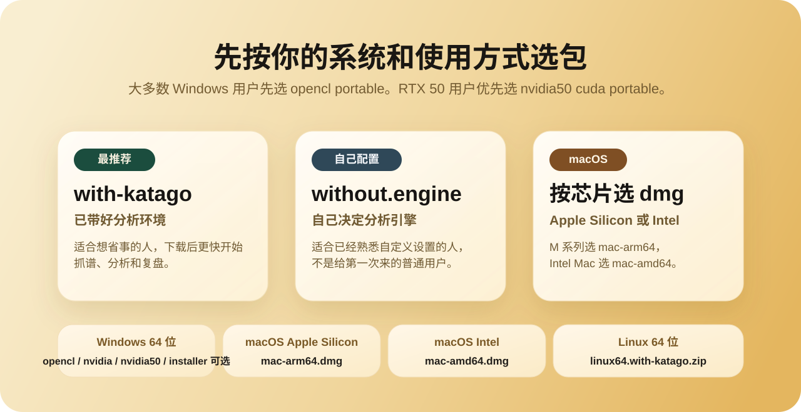

# 发布包说明

这份文档回答三件事：

1. 当前维护版到底公开推荐哪些包
2. 每个包里内置了什么
3. 普通用户应该怎么选

## 先直接看结论

这份文档讲的是当前维护版 `LizzieYzy Next` 的公开发布格式，不是旧 `lizzieyzy` 的历史发布布局。

- 当前维护版公开主推 15 个首次下载主资产，另有 1 个 Windows 免安装小更新包
- Windows 默认优先推荐 `portable.zip`
- 大多数普通用户先下 `windows64.opencl.portable.zip`
- 已有 Windows 免安装版的老用户，日常升级优先下载 `windows64.core-update.zip` 覆盖旧目录，只更新主程序和启动器配置
- OpenCL 表现不好时改用 `windows64.with-katago.portable.zip`
- RTX 20/30/40 系列 NVIDIA 显卡并且更在意速度时改用 `windows64.nvidia.portable.zip`
- RTX 5070/5080/5090 优先试 `windows64.nvidia50.cuda.portable.zip`，TensorRT 加速改为软件内按需安装
- TensorRT 普通用户路径仍是软件内 `KataGo 一键设置` 按需安装，支持断点续传；RTX 20/30/40/50 用户可尝试。GTX 10 系不建议 TensorRT；普通 NVIDIA 包需要 `527.41` 或更高驱动，仍启动失败时改用 OpenCL 包
- `KataGo 一键设置` 会检测本机 NVIDIA GPU / Compute Capability，并在安装 TensorRT 前显示推荐、可尝试、不推荐或未知状态
- TensorRT 一键安装成功后会自动清理完整下载包缓存；首次运行产生的 CUDA/TensorRT 缓存会尽量写入软件自己的 `runtime/`，减少 C 盘额外占用
- RTX 50 / TensorRT 吞吐与功耗对比必须固定模型、配置和缓存，并使用 [RTX 50 性能验收流程](RTX50_PERFORMANCE.md) 记录真实进程、功耗、显存和 KataGo 原始指标
- Release 可附带高级可选 TensorRT 预装分卷包，但它不是默认推荐下载；必须下载全部 `.7z.00N` 并用 7-Zip 从 `.001` 解压
- 当前正式版常用下载统一从 [官网下载页面](https://goagent.top/download/) 进入，GitHub 保留安装器、Linux、历史版本和自动备用；pre-release 仍只在 GitHub

如果你只想先看图再决定，先看这里：

<p align="center">
  
</p>

## 第一次下载就照这个选

普通用户先打开 [正式版下载页](https://goagent.top/download/)。下表中的安装器、Linux 包和历史版本继续从 [GitHub Releases](https://github.com/wimi321/lizzieyzy-next/releases) 下载。GitHub 下载量只统计 GitHub 文件，不包含官网下载页面产生的下载。

| 包类型 | 典型文件名 | 适合谁 |
| --- | --- | --- |
| Windows 64 位 OpenCL 免安装包 | `<date>-windows64.opencl.portable.zip` | 普通用户首选，解压后直接运行 |
| Windows 64 位 OpenCL 安装器 | `<date>-windows64.opencl.installer.exe` | 想保留安装流程的 OpenCL 用户 |
| Windows 64 位 CPU 兜底免安装包 | `<date>-windows64.with-katago.portable.zip` | OpenCL 表现不好时切换使用 |
| Windows 64 位 CPU 兜底安装器 | `<date>-windows64.with-katago.installer.exe` | 想安装的 CPU 兜底用户 |
| Windows 64 位 NVIDIA 极速免安装包 | `<date>-windows64.nvidia.portable.zip` | 有 NVIDIA 显卡，想要更高分析速度，也不想安装 |
| Windows 64 位 NVIDIA 极速安装器 | `<date>-windows64.nvidia.installer.exe` | 有 NVIDIA 显卡，想保留安装流程 |
| Windows 64 位 RTX 50 CUDA 免安装包 | `<date>-windows64.nvidia50.cuda.portable.zip` | RTX 5070/5080/5090 用户首选 |
| Windows 64 位 RTX 50 CUDA 安装器 | `<date>-windows64.nvidia50.cuda.installer.exe` | RTX 5070/5080/5090 用户，想保留安装流程 |
| Windows 免安装小更新包 | `<date>-windows64.core-update.zip` | 已经有旧版免安装目录，只想日常升级主程序的用户 |
| Windows 64 位 TensorRT 高级可选分卷包 | `<date>-windows64.nvidia.tensorrt.portable.7z.001` 等全部分卷 | 熟悉 7-Zip、想离线测试 TensorRT 的 RTX 20/30/40/50 用户 |
| Windows 64 位无引擎便携包 | `<date>-windows64.without.engine.portable.zip` | 想自己配置分析引擎 |
| Windows 64 位无引擎安装器 | `<date>-windows64.without.engine.installer.exe` | 想保留安装流程，但自己配置分析引擎 |
| macOS Apple Silicon 整合包 | `<date>-mac-apple-silicon.with-katago.dmg` | M 系列 Mac |
| macOS Intel 整合包 | `<date>-mac-intel.with-katago.dmg` | Intel Mac |
| Linux 64 位整合包 | `<date>-linux64.with-katago.zip` | Linux 桌面用户 |
| Linux 64 位 OpenCL 包 | `<date>-linux64.opencl.zip` | Linux + AMD/Intel GPU 用户 |
| Linux 64 位 NVIDIA CUDA 包 | `<date>-linux64.nvidia.zip` | Linux + NVIDIA GPU 用户 |

说明：

- `<date>` 代表发布日期，例如 `2026-03-21`。
- 当前维护版公开 release 主列表只保留 15 个首次下载主资产；`windows64.core-update.zip` 是已有免安装用户的日常小更新资产，不是首次下载包。
- TensorRT 分卷包是高级可选资产，不计入普通用户主推荐路径；只下载 `.7z.001` 没用，必须下载全部 `.7z.00N`。
- Windows 64 位现在优先推荐免安装包，安装器作为可选路径保留。
- Windows 免安装包会在解压目录内启用便携模式，配置、日志、保存棋谱、下载权重和软件内安装的 TensorRT 文件都随这个文件夹保存，主要位于 `user-data/`。
- 已有 Windows 免安装版时，关闭软件后把 `<date>-windows64.core-update.zip` 解压到旧目录覆盖即可；它更新 `app/lizzie-yzy2.5.3-shaded.jar` 和 `app/LizzieYzy Next*.cfg`，并携带 `lizzieyzy-next-core.jar` 兼容旧版自动更新请求。这个兼容文件与主 jar 内容、校验值相同，不会覆盖权重、引擎、运行环境、JCEF、readboard、TensorRT 或 `user-data/`。
- 远程算力不属于发布包资产：`设置 -> 远程算力中心` 只保存非敏感连接配置；勾选记住的智子凭据进入系统安全存储，不写普通配置。智子云算力、KaTrain/SWHub 自建远程服务或任何云端模型都不会打进安装包。
- 旧 tag 里如果还看到兼容 zip 或历史包，那属于历史发布格式。

## 每个包里内置了什么

| 包 | 是否自带运行环境 | 是否打开后就能分析 | 打开方式 |
| --- | --- | --- | --- |
| `windows64.opencl.portable.zip` | 是 | 是 | 解压后运行 `LizzieYzy Next OpenCL.exe` |
| `windows64.opencl.installer.exe` | 是 | 是 | 安装后从开始菜单或桌面打开 |
| `windows64.with-katago.portable.zip` | 是 | 是 | 解压后运行 `LizzieYzy Next.exe` |
| `windows64.with-katago.installer.exe` | 是 | 是 | 安装后从开始菜单或桌面打开 |
| `windows64.nvidia.portable.zip` | 是 | 是 | 解压后运行 `LizzieYzy Next NVIDIA.exe` |
| `windows64.nvidia.installer.exe` | 是 | 是 | 安装后从开始菜单或桌面打开 |
| `windows64.nvidia50.cuda.portable.zip` | 是 | 是 | 解压后运行 `LizzieYzy Next NVIDIA 50 CUDA.exe` |
| `windows64.nvidia50.cuda.installer.exe` | 是 | 是 | 安装后从开始菜单或桌面打开 |
| `windows64.core-update.zip` | 否 | 依赖旧免安装目录 | 解压到旧免安装目录覆盖，用于日常升级主程序和启动器配置 |
| `windows64.without.engine.portable.zip` | 是 | 否 | 解压后运行 `LizzieYzy Next.exe` |
| `windows64.without.engine.installer.exe` | 是 | 否 | 安装后从开始菜单或桌面打开 |
| `mac-apple-silicon.with-katago.dmg` | App 自带 | 是 | 按安装画面拖到 Applications，弹出 DMG 后启动 |
| `mac-intel.with-katago.dmg` | App 自带 | 是 | 按安装画面拖到 Applications，弹出 DMG 后启动 |
| `linux64.with-katago.zip` | 是 | 是 | 运行 `start-linux64.sh` |
| `linux64.opencl.zip` | 是 | 是 | 运行 `start-linux64.sh` |
| `linux64.nvidia.zip` | 是 | 是 | 运行 `start-linux64.sh` |

## 给普通用户的选择建议

如果你只想尽快开始：

- Windows：选 `windows64.opencl.portable.zip`
- Windows + RTX 20/30/40 NVIDIA 显卡：选 `windows64.nvidia.portable.zip`
- Windows + RTX 5070/5080/5090：优先选 `windows64.nvidia50.cuda.portable.zip`
- macOS：按芯片选对应的 `with-katago.dmg`
- Linux：选 `linux64.with-katago.zip`

如果你已经熟悉引擎配置：

- Windows：想免安装就选 `windows64.without.engine.portable.zip`，想安装再选 `windows64.without.engine.installer.exe`
- macOS / Linux：也可以先装对应系统的主包，再在软件里改成你自己的分析引擎

## 为什么 Windows 现在优先推荐免安装包

因为普通用户真正需要的是：

1. 下载后解压就能直接运行
2. 如果更喜欢安装流程，也还有安装器可选
3. 运行环境已经带好
4. 第一次打开尽量自动准备好分析环境

对多数 Windows 用户来说，免安装包更接近“解压后就开始用”的真实习惯。
安装器依然保留，但它的角色已经变成“我明确想保留安装流程”。

## 当前内置引擎信息

当前整合包默认使用：

- KataGo 版本：`v1.17.1`
- 软件内按需安装及高级分卷包使用 KataGo `v1.17.2` TensorRT；其他 CUDA、OpenCL、CPU、Metal 后端继续使用官方仍提供完整资产的 `v1.17.1`
- macOS 发布构建固定使用官方 `v1.17.1` commit `5246793f77b480dee91a3b92902d1a9b92860bd0`。如果 Homebrew 稳定版仍滞后，打包脚本会从该 commit 构建 Metal 引擎并校验真实二进制版本，不能只靠 `VERSION.txt` 宣称升级
- 默认权重：官方中型 Transformer `b10c512h8nbt3tflrs-fson-silu-rsnh.bin.gz`，界面显示为“Transformer 10B 均衡版”
- 默认权重大小：`94,281,753` 字节（约 94 MB），SHA-256：`c04db4a503721d948bb720324f3cbdac6088cc9eb243632f020e4b6846f58995`
- Windows 普通 NVIDIA 包：CUDA `12.1` + cuDNN `9.8`；RTX 50 CUDA 包：CUDA `12.8` + cuDNN `9.8`
- Windows NVIDIA 运行时同时携带对应版本的 NVRTC 编译器与 builtins，供 cuDNN 在新显卡上生成运行时内核；发布审计会同时检查这两组 DLL，避免解压即引擎启动失败
- GTX 10 系属于 Pascal。根据 [NVIDIA cuDNN 9.8 支持矩阵](https://docs.nvidia.com/deeplearning/cudnn/backend/v9.8.0/reference/support-matrix.html)，Windows CUDA 12 需要 `527.41` 或更高驱动；如果更新驱动后仍无法启动，使用 `windows64.opencl` 包
- Transformer 在 CUDA、Metal 上性能更好；OpenCL 仍可离线使用，但通常更慢
- `core-update.zip` 只更新主程序，不包含 KataGo 1.17 或新权重；从旧默认模型升级必须安装最新完整包
- 完整包升级只迁移仍使用旧内置 `zhizi 28B` / `default.bin.gz` 的托管引擎；自定义权重、远程算力和启动方式不会被覆盖
- 快速曲线轻量模型：可在 `KataGo 一键设置 -> 权重管理` 按需下载官方 `b10c384h6nbttflrs.bin.gz`（约 38 MB），不进入完整包或普通引擎列表。它只补齐已加载棋谱的缺失曲线，主棋盘分析、对局或整盘精析开始时会退出并释放显存
- TensorRT 加速：普通用户在软件内 `KataGo 一键设置` 中按需安装，支持断点续传；Release 上的 TensorRT 分卷包只作为高级可选离线路径
- TensorRT 预装包保留 TensorRT 作为主分析后端，并内置轻量 CUDA 伴随引擎供 AI 陪练加载 HumanSL；准备陪练时会暂时释放前台持续分析的 GPU 计算资源，退出或失败后恢复用户原状态
- RTX 50 仍优先使用 `windows64.nvidia50.cuda` 主包，TensorRT 作为新架构按需加速项
- TensorRT 安装界面会用 `nvidia-smi` 检测本机 NVIDIA GPU，并在无法读取 Compute Capability 时使用轻量型号映射作为 fallback
- TensorRT 一键安装完成后会自动删除完整下载包；如果旧版本曾留下缓存，可在 `KataGo 一键设置` 里使用“清理 TensorRT 缓存”

路径说明：

- Windows / Linux 权重：`Lizzieyzy/weights/default.bin.gz`
- macOS 权重：`LizzieYzy Next.app/Contents/app/weights/default.bin.gz`
- Windows 免安装包的用户下载权重和 TensorRT：解压目录内的 `user-data/`；TensorRT 下载缓存、CUDA/TensorRT 运行缓存会尽量保存在 `user-data/runtime/`
- Windows 安装器版本为了避免写入 `Program Files`，运行数据可能位于 `C:\Users\Public\Documents\LizzieYzyNext` 或 `C:\ProgramData\LizzieYzyNext`；如果非常在意 C 盘空间，优先使用免安装包并解压到非 C 盘

### Linux Wayland 菜单兼容

- Linux Wayland 会自动使用标准 Swing 菜单栏，规避 JDK 21 下弹出菜单可能造成窗口白屏的问题；Windows、macOS 和 Linux X11 继续使用原有菜单外观。
- 诊断包会记录桌面会话、实际菜单模式、Java 版本、显示设备以及可安全读取到的 NVIDIA 型号和驱动版本，不记录用户名、目录原文或其他个人数据。
- 排查时可追加 JVM 参数 `-Dlizzie.menu.presentation=native` 强制标准菜单，或用 `-Dlizzie.menu.presentation=custom` 临时对照原菜单。该参数只用于诊断，不建议普通用户长期修改。
- 相关 JDK 修复进展见 [OpenJDK JDK-8342096](https://bugs.openjdk.org/browse/JDK-8342096)。Linux 发布运行时是否升级到 JDK 25，将在 KDE Plasma Wayland 与 NVIDIA 真机验收完成后单独决定。

## 远程算力中心

如果本机显卡不够，或者临时想用更强算力，可以在软件内打开 `设置 -> 远程算力中心`：

- `智子云算力`：手机号/邮箱登录后，软件会创建一个虚拟 KataGo 引擎，主引擎、实时分析、AI 对局、引擎对局、KataGo 形势判断和闪电分析都走同一类 GTP 桥接体验。
- 智子算力套餐在软件内可直接选择：普通用户默认使用 `VIP 包月`，对应 `--gpu-type vip-share`；非 VIP 用户可在高级设置切换到 `按量 1x`，也可以按需选择 `3x/6x/12x/24x` 按调用计费档位。
- 预设名称里的 `智子28B` 是默认模型，`TensorRT / CUDA` 是云端 KataGo 后端；这不是充值套餐名。高级用户仍可在参数里修改 `kata-name` / `kata-weight`，但普通用户不需要理解这些参数。
- 智子登录凭据使用平台原生安全存储：Windows 为用户级 DPAPI、macOS 为 Keychain、Linux 为 Secret Service。安全存储不可用时不会回退到 Base64 或明文配置，只在当前运行期间保留，并提示下次需要重新登录。
- `使用本机引擎`：随时切回本机已配置的 KataGo，不改变发布包里的离线引擎和权重。
- `自建远程算力 / 旧版 SSH 兼容`：旧版 SSH 远程引擎仍可通过引擎设置使用；后续自建服务连接码、二维码和 KaTrain/SWHub 风格链接会共用这个入口。
- 密码只用于登录请求，不写入普通配置；用户可分别选择“记住登录”和“记住密码”，勾选的凭据仅保存到操作系统安全存储。远程算力的额度和费用以对应服务账号为准。

## 当前内置同步工具信息

- Windows 发布包现在内置原生 `readboard/readboard.exe` 和依赖文件，正常使用不需要下载外部同步工具
- Windows 原生路径：`Lizzieyzy/readboard/`
- 软件内只保留原生 readboard 同步入口，不再交付或启动旧的 Java 简易同步工具

## 离线包体与启动性能治理

当前主发布包仍按“下载后离线可用”设计：JCEF 浏览器运行时、默认权重、KataGo、readboard、Java 运行环境等必要组件继续随包交付，不在首次使用时临时下载。

为了让完整离线包更轻、更快，发布脚本会尽量做三类无感优化：

- 自定义 Java runtime：发布脚本会用 `jlink` 生成专用运行环境，并启用 `--strip-debug`、`--compress=2`、`--no-header-files`、`--no-man-pages`。如果当前构建机不支持 `jlink` 或某个平台出现兼容问题，会自动回退到原运行环境，不影响发包。
- Windows 自定义 runtime 固定包含 `jdk.accessibility` 和 Java Access Bridge 原生组件，确保 NVDA、Windows 讲述人等辅助技术可以读取 Swing 控件；打包和 CI 会同时校验模块与桥接文件，缺失时拒绝生成发布包。
- Windows 启动内存：启动器不再固定申请 `-Xmx4096m`，而是按机器可用内存自适应设置 JVM 上限。这样低内存电脑不会因为无法预留 4 GB 堆而只显示 `Failed to launch JVM`，高内存电脑仍可按需使用更多内存；KataGo 引擎显存和内存仍由独立进程管理。
- Base CDS 启动共享：`jlink` runtime 构建后会执行 `java -Xshare:dump` 生成可随应用目录移动的基础类归档，启动参数使用 `-Xshare:auto`。不再打包绑定构建路径的 AppCDS；实测该归档在安装或解压到新目录后会因 classpath 不匹配而失效，移除后可避免无效体积和小更新后的归档过期。
- JCEF 浏览器运行时：Windows 和 macOS 发布包都内置与 CPU 架构匹配的 JCEF，弈客网页版、弈客大厅和网页棋谱无需首次启动下载；macOS 打包及签名流程会校验 Chromium framework、`libjcef` 和全部 Helper app，缺失时直接终止发布。
- macOS KataGo 运行库：发布脚本会递归收集 Homebrew KataGo 的全部非系统动态库，并改写为 App 内相对路径；打包前和最终 DMG 挂载后都会检查外部依赖并实际运行 `katago version`。只要仍引用 `/opt/homebrew`、`/usr/local`、`@rpath` 或缺少运行库，发布流程会直接失败。
- macOS 应用索引：每个 release tag 都会生成单调递增的 `CFBundleVersion`，最终签名 DMG 会再次核对该值，避免 Spotlight 的“应用”视图把新版与旧 DMG 副本混为同一构建。
- JCEF 语言资源：发布包只保留软件六种语言需要的 Chromium 语言包（简体中文、繁体中文、英语、日语、韩语、泰语），浏览器内核、HTTPS、弈客、腾讯棋谱等功能文件完整保留；CEF locale 会按软件语言或系统语言安全回退。
- 包体审计报告：每次打包会在 `dist/release-meta/` 生成 `*-package-size-audit.md` 和 `*.json`，记录 shaded jar、runtime、平台内置 JCEF、权重、引擎、readboard、最终 release asset 的大小。报告会写入 GitHub Actions summary，并对异常增大的 jar、custom runtime、接近 GitHub 单资产上限的 release asset 给出 warning；第一阶段只预警，不阻断紧急发版。

维护者本地常用命令：

```bash
mvn -Dfmt.skip=true -DskipTests package
python3 scripts/package_runtime_tools.py audit-sizes \
  --root . \
  --output dist/release-meta/local-package-size-audit.md
python3 scripts/package_runtime_tools.py compare-audits \
  --before dist/release-meta/previous-package-size-audit.json \
  --after dist/release-meta/current-package-size-audit.json \
  --output dist/release-meta/package-size-comparison.md
OUT_DIR=dist/perf SCENARIO=startup DURATION_SECONDS=45 \
  bash scripts/run_jfr_benchmark.sh
```

说明：

- JFR 录制只用于本地性能分析，不会打进用户安装包。
- JFR 脚本会同时生成 `.analysis.md`、`.analysis.json` 和 `.metrics.json`，记录主要分配热点、采样权重、年轻代/老年代 GC、峰值常驻内存与 jar 大小，便于同场景前后对比。
- Base CDS 和自定义 runtime 都是发布层优化，不改变用户功能和配置位置。
- 不激进裁剪 JCEF 浏览器核心资源；仅移除软件不提供的额外 Chromium locale，避免影响弈客、腾讯棋谱和网页流程。

## 新旧发布格式怎么理解

从新的维护版发布开始：

- Windows 64 位主推荐资产是 `portable.zip`
- Windows 64 位同时提供 `opencl`、`with-katago`、`nvidia`、`nvidia50.cuda` 四条内置引擎线的安装器和便携包
- Windows 64 位无引擎包同时提供安装器和 `.portable.zip`
- 当前公开 release 主列表固定为 15 个首次下载主资产；`windows64.core-update.zip` 是已有 Windows 免安装用户的小更新资产；TensorRT 分卷包如出现在 Release 中，定位为高级可选资产，不替代软件内断点续传安装
- 旧的兼容 zip 只作为历史 tag 说明保留，不再放进主推荐区
- R2 只镜像当前正式版的 Windows 免安装包、小更新包、两款 macOS DMG 和 TensorRT 分卷；完整策略与维护流程见 [Cloudflare R2 正式版下载与升级](R2_RELEASES.md)

## 相关文档

- [安装指南](INSTALL.md)
- [常见问题与排错](TROUBLESHOOTING.md)
- [已验证平台](TESTED_PLATFORMS.md)
- [发布检查清单](RELEASE_CHECKLIST.md)
- [项目首页](../README.md)
