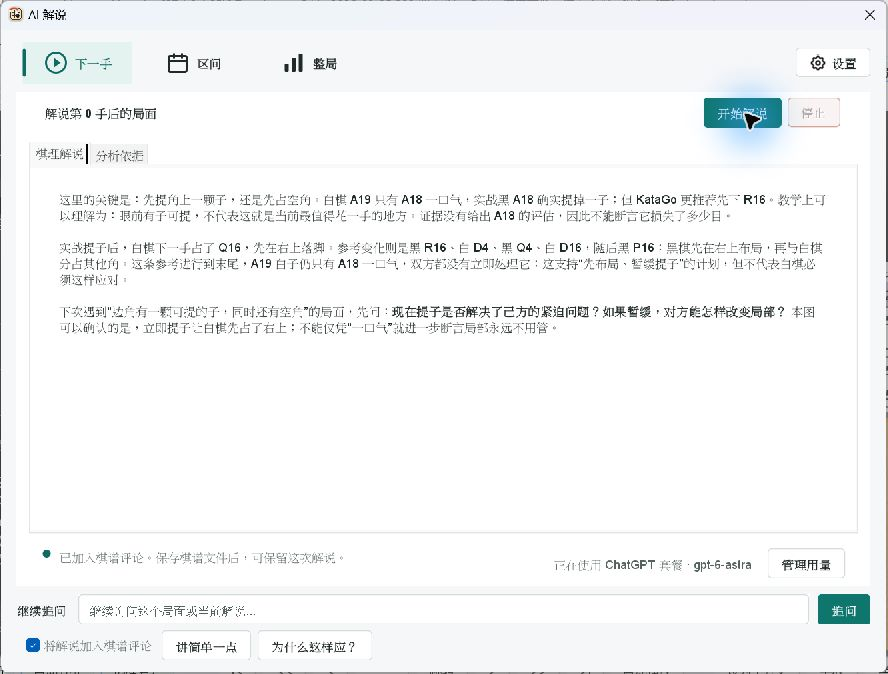
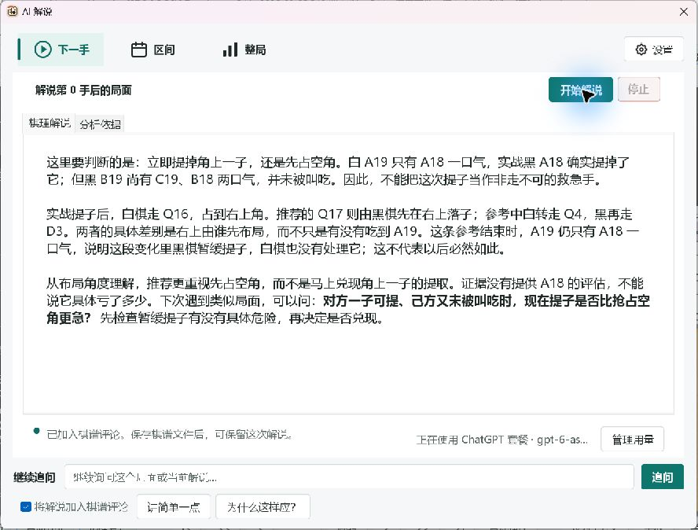

# AI Commentary Teaching and Typography Acceptance

## Scope

Follow-up to PR #575, based on `3f9d2543b8ed5cfdf6790e4abab0faf77cc2ca84`.
This revision changes commentary evidence, prompts and the Swing reading surface.
It does not change authentication, credential storage, engine protocols or the
foreground analysis lifecycle.

- Freeze board stones, groups, liberties and reference continuations before a
  request. Replay on a private history with existing capture/simple-ko logic.
- Preserve the evaluated actual move outside the top three candidates; keep
  unavailable actual-move loss unknown. Correct score-loss units and transposed
  knowledge-matching coordinates.
- Select at most five spaced teaching moments for a range or whole game. Explain
  a concrete decision, a useful reference and a conditional thinking question,
  instead of enumerating winrates and candidate statistics.
- Validate coordinates and basic numerical claims against the frozen evidence.
  A failed validation permits at most one correction request, which may consume
  additional provider quota. Network failures are not automatically retried.
  Only validated final text is displayed as the completed lesson and saved.
- Keep the main board as the board display. The commentary window has only
  explanation and evidence tabs, with compact mode controls and follow-up prompts.
- Use the shared workspace font and locale fallback. Body text defaults to 16
  logical points, evidence to 14, and controls/hints to at least 13. Explicit
  custom fonts and larger user text remain in effect.
- Check the actual Swing HTML glyph fonts, not only the CSS declarations, to
  prevent small serif fallback. Secondary buttons use regular weight.

## Automated Results

Final pre-submission `verify` completed successfully on 2026-10-02 in 5 minutes
8 seconds: 4,717 tests, zero failures/errors, 127 conditional skips. This is a
fresh run including the final typography changes, not an earlier candidate.

| Suite | Tests | Failures | Errors | Skipped |
| --- | ---: | ---: | ---: | ---: |
| Full Maven verify, Surefire | 4707 | 0 | 0 | 120 |
| Full Maven verify, Failsafe | 10 | 0 | 0 | 7 |
| Typography, view and workbench targeted tests | 28 | 0 | 0 | 0 |
| Native commentary/settings matrix, JVM scale 1.0 | 51 | 0 | 0 | 0 |
| Native commentary/settings matrix, JVM scale 1.5 | 51 | 0 | 0 | 0 |
| Native commentary/settings matrix, JVM scale 2.0 | 51 | 0 | 0 | 0 |

The native matrix covers six supported languages plus zh-HK compatibility,
commentary lifecycle, settings, Markdown and assets. These are JVM-simulated
scales on Windows, not changes to Windows display scaling. Component screenshots
are saved in logical dimensions.

Commands used:

```text
mvn -B -Djava.awt.headless=true -Dfmt.skip=true verify
mvn -B -Djava.awt.headless=true -Dfmt.skip=true -DskipTests package
python scripts/test_windows_launcher_packaging.py
python scripts/check_line_endings.py
python scripts/check_markdown_links.py
git diff --check
```

Packaging, launcher guards, line endings, local Markdown links, changed-Java
format checking and `git diff --check` passed. `LoggingProviderSmokeIT` and both
`ChatGptRuntimeSmokeIT` tests ran successfully; skipped hardware/desktop tests
are not represented as executed.

The two new typography tests initially exposed a null `uiConfig` in the
lightweight fixture. The fixture was initialized; all targeted tests were
rerun successfully without weakening production behavior or assertions.

## Windows EXE Acceptance

- Windows 11 23H2, build 22631.6199, RTX 3070.
- Isolated NVIDIA portable: `LizzieYzy Next NVIDIA.exe`, bundled Java, B11 CUDA.
- No real installation, user configuration, game records or engine caches were
  replaced. Only a QA copy and a synthetic position were used.
- The EXE loaded the SGF and local engine analysis. A real signed-in ChatGPT
  request produced a three-paragraph lesson while foreground visits increased.
- The synthetic position has white A19 with its only liberty at A18, and black
  B19 already present. The reply explains capturing versus taking an open corner
  without inventing a numerical loss for an unevaluated actual move.
- Visually checked Chinese paragraphs, bold emphasis, input/footer controls and
  evidence tab. No duplicate board preview, horizontal scrolling or cropped text
  appeared in these scenarios.
- Preview JAR SHA-256:
  `2A0DBEF1436A5121A61CB03366C8AF672AA2930677453300BF1F531E0C20A8CB`.

### Typography Before



### Typography After



Both screenshots use the synthetic test position. They are separate live
requests, so wording and engine candidate details differ. They are a typography
comparison, not a controlled model-quality benchmark. No account identifiers,
credentials or private game records are included.

## Remaining Limits

- Actual Windows system DPI changes and NVDA/Narrator spoken output were not
  verified in this revision. Latest macOS/Linux rendering was not tested here.
- Real online output was reviewed in Simplified Chinese. Other languages have
  resource/glyph/layout coverage, not human review of live model replies.
- Geometric groups/liberties and legal reference replay do not prove life/death,
  forced play, best defense or superko/variant-rule legality. Validation is not
  a proof of every strategic statement.
- Historical SGF comments retain prose, not the original frozen evidence.
- Provider latency is unchanged; this revision does not claim faster networking.
- PR #575's independent authentication/security acceptance gates remain in
  effect. This submission does not authorize merge or release.
