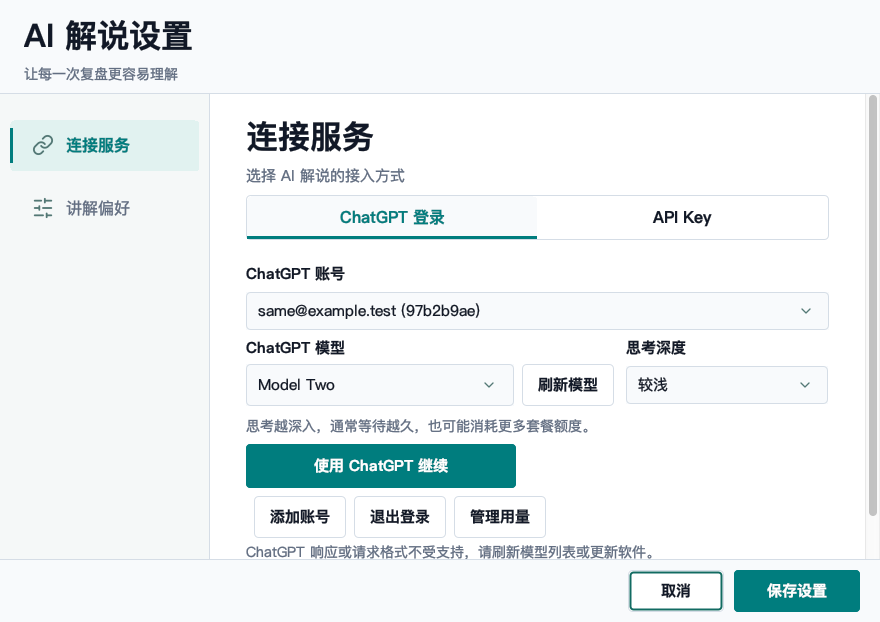
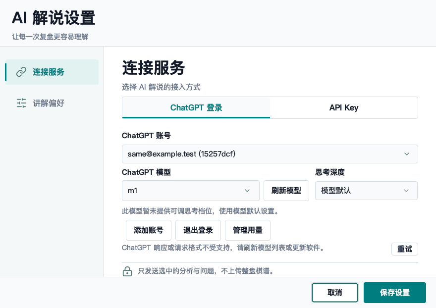
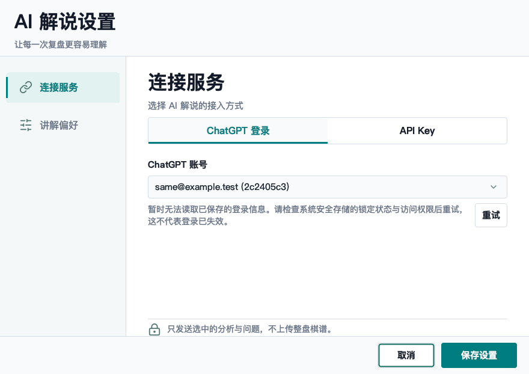
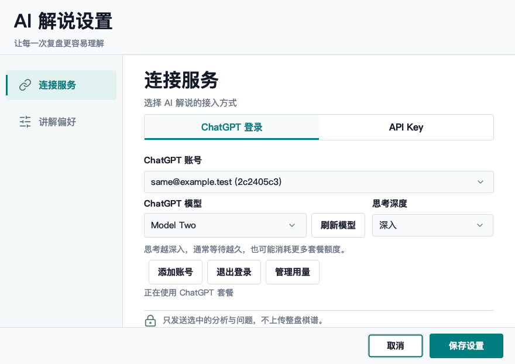
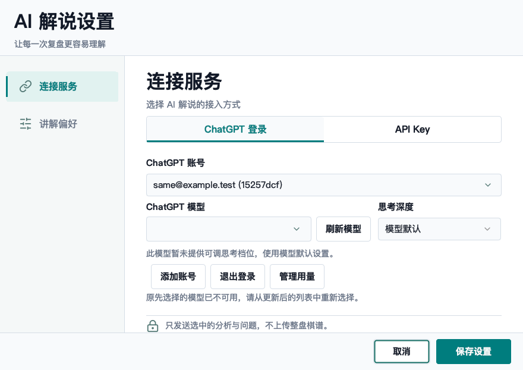

# ChatGPT settings and secure-login UX regression, 2026-10-01

## Scope and evidence

This is a local macOS/JDK 21 acceptance pass for PR #575, not a Windows certification.
Native Swing screenshots below were captured during this run with synthetic accounts.
Real-account checks use the unchanged, already-authorized packaged acceptance application;
that application is not claimed to contain the new UI changes. No real account identity,
tokens, authorization URLs or secrets appear in these screenshots or this report.

## User flow

1. Open settings and choose a provider: **PASS**. ChatGPT and API Key remain equal alternatives.
   Opening ChatGPT no longer reads an inactive saved API key. Selecting the API Key tab explicitly
   restores that key off the EDT; switching tabs does not overwrite an intentionally cleared draft.
2. Refresh models: **FIXED / PASS**. Before the repair, refresh discarded an unsaved model choice,
   and a malformed model response presented a second login button and an unnecessary scrollbar.
   Now the current choice and thinking depth remain; a compact Retry action repeats only the
   catalog request. No browser authorization or inference request is started.
3. Temporarily unavailable secure storage: **FIXED / PASS**. Opening settings now distinguishes
   an unreadable credential from a missing/revoked login. Retry retains the original registration
   and secrets, and recovers the selected model and depth without a new authorization or write.
   If storage becomes unavailable at Save, the form stays open instead of reporting success;
   after recovery, both the account status and the old footer error are updated.
4. Model removed, save and reopen: **PASS**. A removed model requires an explicit replacement;
   it does not silently select a different model on subsequent refresh. Saving/reopening restores
   per-account model/depth. Confirmed refresh revocation still requires login; transient failures
   do not destroy credentials. Local logout does not claim remote revocation if tokens were unreadable.

### Before: model failure incorrectly suggests another login

### After: keep the selection and retry without logging in again

### Saved credential temporarily unavailable

### Recovered without new authorization

### Removed model requires a new choice

## Automated and native checks

- A regression test first failed on refresh discarding an unsaved model, confirming the defect.
- The first repaired native run also caught an unnecessary scrollbar from the Retry button;
  compact control sizing fixed it without increasing the window size or hiding the error.
- Final focused run: 82 test invocations, zero failures/errors, two explicitly skipped native
  cases (Windows DPAPI on macOS and separately opt-in legacy CLI Keychain migration).
- Native Swing checks passed for Simplified Chinese, Traditional Chinese/Taiwan and Hong Kong,
  English, Japanese, Korean and Thai: provider switching, example placeholders, preferences,
  model/depth save, blocked-storage retry and recovery, default-window layout and compact-window
  button reachability. Screenshots are rendered from the actually displayed Swing component tree.
- The final screenshot review caught a stale footer error after successful recovery, even though
  the original assertions passed. An explicit stale-error assertion now covers that repair.
- Native Keychain canaries used unique synthetic entries, tested long values up to 65,536 bytes
  plus Unicode, preserved separate services, and cleaned up afterwards. Three unauthorized
  background reads completed without interaction and restored the original interaction policy.
- Fake-service coverage includes token refresh, account isolation, cancellation, complete vs
  interrupted streams, credential errors and use of a token rotated during catalog lookup.
- Final JDK 21 `mvn -B -Dfmt.skip=true -Djava.awt.headless=true verify`: BUILD SUCCESS.
  Surefire: 4,548 invocations, zero failures/errors, 101 explicitly skipped; Failsafe: 7
  invocations, zero failures/errors, 6 explicitly skipped. Shaded packaging and packaged
  logging smoke passed. This followed a successful clean verification and the final native run.
- Line-ending policy, its 6 unit tests, Markdown links and `git diff --check` passed. A bounded
  scan of the isolated account configuration and acceptance logs found no plaintext token
  fields, Bearer credentials, API keys or JWT payloads. Synthetic test fixtures are not secrets.

## Real saved-account check

The unchanged packaged application was launched in a new process against the existing isolated
registration. It returned `MODEL_CATALOG_OK count=4 sessionOnly=false` and retained
`gpt-6-astra` / `high`. This check completed without another sign-in or user intervention.
It did not generate a new paid commentary, revoke the account or change its selected model.

## Limits

Windows physical desktop/DPI, Linux Secret Service, VoiceOver/NVDA and a signed release-package
upgrade remain unverified here. The native macOS screenshots and synthetic fault injection do
not substitute for those environments. Initial authorization or a changed/untrusted executable
may still require normal macOS approval; no ACL, system password or global security policy was
weakened to avoid it. Tests do not deliberately lock the user's real keychain or invalidate the
user's active account. No release or merge is part of this acceptance pass.
