# PR 575: Windows acceptance, 2026-10-01

## Scope and environment

The ChatGPT commentary branch was merged with main `c013d8ce` in local merge
`9f85beae`. Tests use a separate worktree and QA portable, configuration, APPDATA
and credential directories. Real installation data, other applications' tokens,
security settings and proxy settings are not modified.

- Windows 11 Pro, build 22631; RTX 3070 Laptop GPU.
- Compilation/tests: JDK 21.0.2. The visible product uses its packaged Temurin
  runtime 21.0.12.1+1, not the system JDK.
- Executable: `LizzieYzy Next NVIDIA.exe`, with the candidate shaded JAR.
- EXE location: `C:\ailearn3\lizzieyzynext\.qa\pr-acceptance-20261001\portable`.
- Evidence root: `C:\ailearn3\lizzieyzynext\.qa\pr575`.
- High-DPI runs use JVM `sun.java2d.uiScale=1`, `1.25`, `1.5`, `2` on this Windows
  desktop. These are not claims that Windows system scaling was changed.

## Reproduced and repaired

1. A pending authorization could sign an account back in after logout, including
   logout from another application instance. A persisted authorization revision,
   checked under the session lock before saving credentials, rejects old callbacks.
   Explicitly starting a new login after logout remains possible.
2. The login deadline could report timeout while native credential persistence
   succeeded. The deadline and final commit now share the same synchronization.
   All three new lifecycle cases failed before repair, then passed.
3. Windows DPAPI reads incorrectly stripped trailing whitespace from decrypted
   secrets. Native canaries now verify exact values up to 65,536 characters plus
   Unicode, independently reopened stores, namespace separation and encrypted
   persistence. The initial exact-value test failed before repair.
4. Fixed outer-window dimensions left less form space on Windows, producing
   unwanted scrollbars. Initial size now reserves the content area. Four native
   settings tests failed before the fix.
5. A fixed Chinese font rendered Thai as boxes. Settings now use the existing
   locale-aware font resolver. The selected sidebar label reserves bold-text and
   icon width; Japanese footer buttons also reserve sufficient width at 150%.
   Visual review caught issues not covered by the original width-only assertions.
6. The new glyph test found Korean text in the Thai dan label. The Thai dan/kyu
   labels are corrected. The test covers all settings and ChatGPT strings in each
   shipped locale, including Traditional Chinese for Taiwan and Hong Kong.
7. The API-key Responses parser accepted `[DONE]` without `response.completed`.
   It now requires the actual completed event; Chat Completions retains its own
   valid `[DONE]` semantics. Incomplete commentary must not be written to SGF.
8. Follow-up screenshot review found the same missing Thai glyphs in the main
   commentary window, outside the settings page. Locale-aware fonts now cover
   that view, including its HTML reader, before button width measurement. New
   recursive glyph assertions cover labels, buttons and text components, rather
   than treating correctly sized boxes as readable text.

## Validation status before runtime follow-up

The pre-follow-up local verification passed: all 65 steps of
`python scripts/run_local_ci.py --profile all` passed in 643.2 seconds, including
the complete Windows Maven `verify`, shaded packaging, logging-provider smoke,
launcher/JCEF/NVIDIA packaging checks, release checks, script syntax, Markdown,
line endings and `git diff --check`.

- Surefire: 4,681 tests, 0 failures, 0 errors, 120 skips.
- Failsafe: 8 tests, 0 failures, 0 errors, 7 skips. `LoggingProviderSmokeIT` ran.
- Combined final JUnit summary: 4,689 tests, 0 failures, 0 errors, 127 skips.
- Separate Windows credential gate: 42 tests, 0 failures/errors, 3 macOS skips.
- Windows product acceptance script fixtures: 29 tests, zero failures/errors.
- Log: `all-accepted.log`; machine-readable summary:
  `target/pr575-local-ci-accepted/local-ci-summary.json` in the isolated worktree.

This Windows `all` profile does not pretend to run on Linux: it deduplicates the
full Maven invocation and runs the portable script checks on Windows. The summary
records parent `9f85beae` plus the then-uncommitted fixes described here, not a
clean test of the parent commit alone.

Final focused/native reruns, including the main-commentary glyph fix:

| JVM scaling | Invocations | Failures | Errors | Skips |
| --- | ---: | ---: | ---: | ---: |
| 100% | 102 | 0 | 0 | 3 |
| 125% | 102 | 0 | 0 | 3 |
| 150% | 102 | 0 | 0 | 3 |
| 200% | 102 | 0 | 0 | 3 |

Each run includes ChatGPT protocol/lifecycle, DPAPI, API-key streaming,
settings assets/fonts, and visible settings/commentary tests in the shipped
locales. Skips are three macOS-only credential tests. Counts are per run, not
408 unique test cases. Logs are `accepted-native-{100,125,150,200}.log` under the
evidence root.

After fixing main-commentary glyphs, 18 focused tests passed with zero failures,
errors or skips, including actual visible windows in all shipped locales. The
earlier full rerun was intentionally interrupted at the launcher fixture step
when screenshot review found this remaining issue; it is not counted as passed.

The first full Windows run executed 4,680 tests: one failure (the Thai dan
label), zero errors, 120 skips. It is recorded as a failed run, not a successful
verification or packaging gate.

The isolated EXE was visibly launched and the AI commentary connection form was
opened from the actual toolbar. The process loaded
`portable\runtime\bin\server\jvm.dll`; its bundled KataGo child produced live
B11 CUDA analysis and visible candidate moves. No system Java is needed for this
product launch. The unconnected form screenshot contains no account details.

The pre-follow-up packaged JAR and installed QA-copy JAR had matching SHA-256:
`c5b69c276355559cff31085d1a0deccfd24f336de169de070817812887adfcf4`.

## Follow-up: connection failed before browser launch

The account owner then clicked Continue and saw the generic network error. The
earlier JAR-only portable acceptance missed a required runtime dependency: the
old Temurin 21.0.12.1 image omitted `jdk.httpserver`. Running the actual sign-in
constructor with that packaged Java reproduced `NoClassDefFoundError` for
`com/sun/net/httpserver/HttpServer`, before any OpenAI request.

The shared trimmed runtime now explicitly retains the module. Runtime construction
and Windows/macOS final app-image packaging exercise the production loopback flow
with packaged Java, including invalid state, denial, retry and cancellation. A
missing-module core-only update gets a localized complete-package repair message,
not a suggestion to keep retrying the network.

The QA portable runtime was rebuilt with the same Temurin 21.0.12.1+1, preserving
the old runtime for reproduction. Its offline callback probe and launcher-only
EXE smoke both passed. The visible EXE loaded the corrected bundled `jvm.dll`,
ran B11 CUDA analysis, and reopened the connection page for the account owner.
This does not yet prove official authorization, model retrieval or commentary.

Evidence under the QA root: `runtime-before-network-error.png`,
`runtime-after-connection-ready.png`, `runtime-build21.log`,
`runtime-fixed21-manifest.json`, `old-runtime-actionable-error.log`, and
`runtime-exe-smoke.log`. The first new full local run failed one of the 29 Windows
process-cleanup fixtures before reaching Maven; its standalone recheck passed.
That failed run is retained in `runtime-local-ci.log`, not counted as a pass.
The next run completed 4,681 Surefire tests with one failure: the new offline
probe did not use the repository's shared connection helper. It now uses that
helper (the standalone probe has no loaded user proxy configuration). The test
guard was not bypassed or weakened.

An actual fallback `jpackage` invocation also rejected the old script's nested
`--jlink-options --add-modules`. Windows and macOS fallback arguments now use
top-level `--add-modules ALL-MODULE-PATH`; optimized packages retain the explicit
small desktop module set. A newly generated Windows fallback app-image passed
the same offline callback probe. Logs: `fallback-build.log` (failure) and
`fallback-build-fixed.log` (successful build). macOS packaging is not claimed as
physically tested here.

Final follow-up verification: **66/66 local All steps passed** in 655.625 seconds
with the follow-up changes atop `44de5f92`. Surefire: 4,681 tests, 0 failures,
0 errors, 120 skips. Failsafe: 10 tests, 0 failures, 0 errors, 7 skips. Combined:
**4,691 tests, 0 failures/errors, 127 skips**. Both new runtime integration cases
executed, as did the logging-provider smoke. The 29 Windows process fixtures,
five new runtime-script tests, shaded packaging and repository checks passed.
The full log is `runtime-local-ci-final.log`; structured summary is
`target/pr575-runtime-local-ci-final/local-ci-summary.json` in the PR worktree.

The final shaded JAR SHA-256 is
`5dbd5d052ce45a3dbee24060dac18dfeb399bd316330c33876261ac1745abc89`.
It passed the callback smoke using the actual QA portable's corrected Java.
The still-open user preview uses JAR
`3951628a2947e9afa95da7e8888810560cda733eb5a459f46c5ace895beca0e4`.
ZIP-entry comparison found only `ChatGptRuntimeSmoke.class` different after the
probe's network-helper correction; every login/UI class and resource is identical.
The active preview is not overwritten or restarted during the owner's authorization.

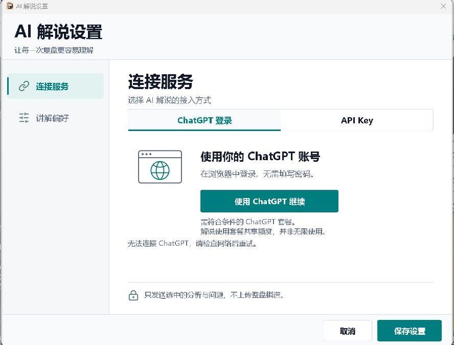

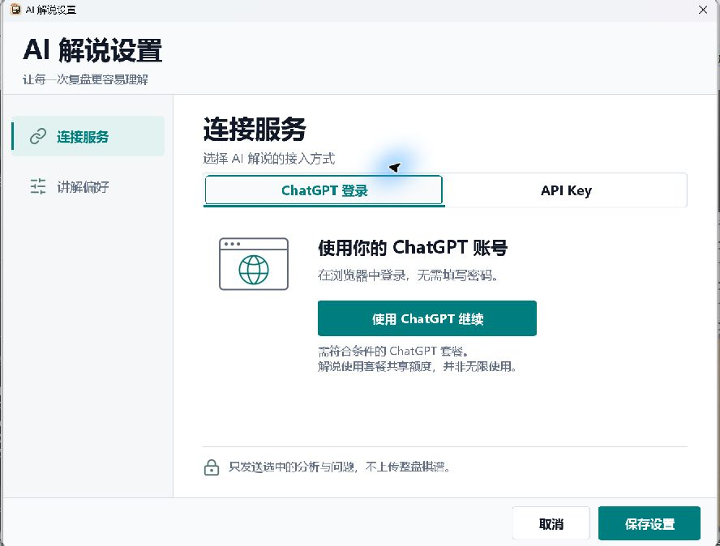

## Logged-in follow-up and Codex effort labels

The account owner completed the official browser authorization on October 1.
The following checks used that authorized session only in the isolated QA
portable and its isolated APPDATA, never another application's credentials:

- The actual NVIDIA EXE listed five account-available models. GPT-6 Astra and
  GPT-5.6 Sol/Terra advertised `low`, `medium`, `high`, `xhigh`, `max`, `ultra`;
  GPT-5.6 Luna stopped at `max`, and GPT-5.5 stopped at `xhigh`.
- A real current-position explanation streamed, completed, and displayed the
  SGF-comment write-back confirmation. A second request was stopped from the
  visible window; the UI returned to its stopped state without reporting success.
- After normal EXE exit and replacement of the QA JAR, the EXE restarted with
  bundled Java and B11 CUDA analysis (about 320 visits/s observed). No new login
  was required. The saved model and `low` effort reappeared in settings.
- A separate JVM restored the same DPAPI session (`sessionOnly=false`), fetched
  the model catalog, and completed a bounded, two-sentence synthetic request
  (105 output characters). Only model capabilities and completion metadata were
  printed; no credentials, account identifiers or real game records were logged.
- The updated EXE then completed another visible current-position explanation.
  This is transport/lifecycle evidence, not a claim that all generated Go advice
  is correct: the existing grounding check flagged unsupported coordinates and
  its warning remained visible. That content-quality limitation is not hidden.

The label mismatch was in display strings, not the transmitted effort: the old
Chinese UI called `low` "较浅" and `high` "深入". Labels now use concise levels
with the canonical Codex identifier, such as "低 (low)", "高 (high)",
"超高 (xhigh)", "最大 (max)" and "极限 (ultra)". The model default, server-provided
options/order, per-model preferences and pre-request validation remain unchanged.
The real-account six-level picker was inspected in the updated EXE.

Targeted automation: 60 tests, 0 failures/errors/skips. Actual Swing settings
tests at JVM 100% and 150%: 6 tests each, 0 failures/errors/skips. At JVM 200%,
the settings plus commentary lifecycle suites ran 17 tests with no failures,
errors or skips, covering all six languages plus zh_HK, all advertised effort
labels, saved preferences, model changes, interrupted streams, follow-ups and
stale-result write protection. An earlier 150% invocation skipped the 11
commentary cases because its opt-in flag was absent; it is not counted as a
commentary pass. These are JVM scaling tests, not Windows system-DPI changes.

Final local `All` gate: **66/66 steps passed** in **622.500 seconds**. Surefire:
**4,688** tests, 0 failures, 0 errors, 120 skipped. Failsafe: **10** tests,
0 failures, 0 errors, 7 skipped. Combined: **4,698** tests, **0 failures/errors**,
127 skipped. Packaging, Windows launcher checks, release-script tests, line
endings, Markdown links and `git diff --check` passed. The packaged Java callback
probe again printed `CHATGPT_LOOPBACK_SMOKE_OK`; the running EXE's `jvm.dll` was
verified under the QA portable's own `runtime/bin/server` directory.

Final built JAR and the actually tested QA-copy JAR share SHA-256:
`112e97632b3fee94c25bcee625451e77b14624bcd02cde6dd2765ec41351301a`.
Full logs and JSON summary are at `.qa/pr575/reasoning-local-ci.log` in the primary
workspace and `target/pr575-reasoning-local-ci/local-ci-summary.json` in the PR
worktree. Native screenshots are in `.qa/pr575/reasoning-native-{100,150,200}`.

The desktop controller cannot retain child-window keyboard focus consistently;
the real EXE dropdown choices could be inspected, but reliable cross-model
selection/keyboard traversal is covered by the native Swing fixture rather than
claimed as a complete manual keyboard pass. Screenshots containing real account
identity are not included. The settings evidence below uses synthetic accounts.

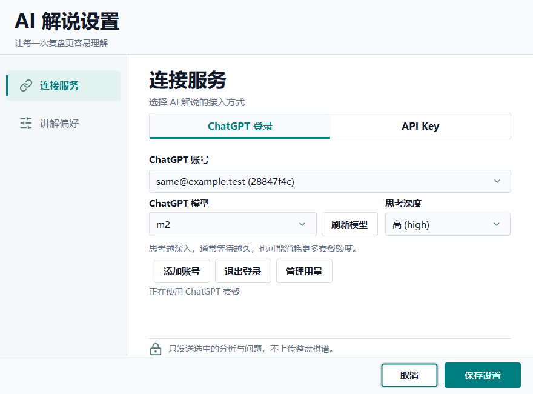

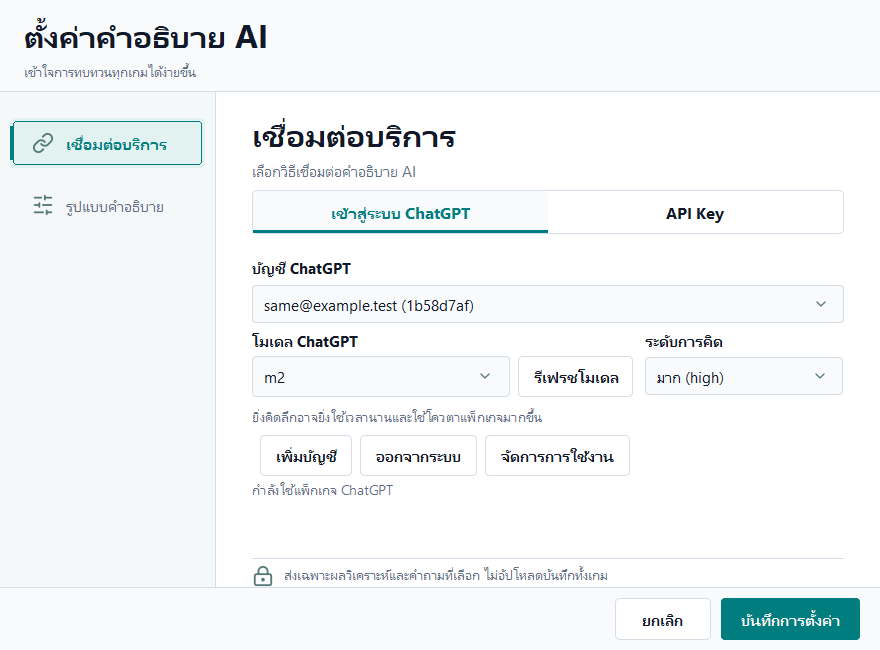

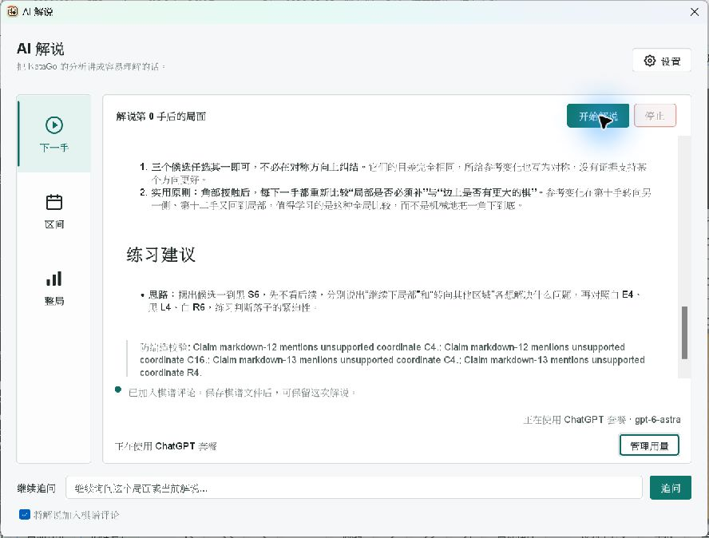

## Displaying account-advertised defaults

A metadata-only query through the same authorized QA session confirmed that the
public account model catalog supplies `default_reasoning_level`. On October 1,
GPT-6 Astra, GPT-5.6 Terra/Luna and GPT-5.5 advertised `medium`; GPT-5.6 Sol
advertised `low`. These are account-catalog observations, not universal API
defaults or hard-coded mappings. No inference or user game upload was needed
for this query, and no token or account identity was printed.

The picker now shows **Follow model default: Medium** (localized with the
canonical identifier). It accepts a default only when it is a valid advertised
supported effort. Unknown/invalid defaults explicitly show **not published**.
Following the default keeps the saved preference automatic; inference resolves
the current catalog default and sends it explicitly. This avoids mistaking a
client recommendation for the value that an omitted API parameter would use.
An unknown default still omits the parameter; explicit user preferences remain
unchanged. Model switches and refreshes update the label, without pinning a
previous model's default.

The first 200% native check caught clipping in the old narrow, side-by-side
selector. A stacked-label attempt then exposed unnecessary vertical scrolling.
The final compact two-row form puts labels beside full-width controls; it passed
all six native settings cases at JVM 200%, including six languages plus zh_HK.
Focused metadata/request/label tests passed **63 cases, no failures/errors/skips**.
These scale checks use JVM scaling, not physical Windows display changes.

Final verification for this follow-up: Maven `verify` succeeded (including the
shaded package). Surefire: **4,691**, 0 failures/errors, 120 skipped; Failsafe:
**10**, 0 failures/errors, 7 skipped. Total **4,701**, 127 skipped. The six native
settings cases also passed at JVM 100% and 150% with no skips. Windows launcher
packaging, line-ending and whitespace guards passed. JaCoCo warned about stale
MacKeychainStore execution data from earlier specialized tests; this run is not
a fresh coverage baseline.

A separate settings-only EXE preview used the candidate JAR and bundled runtime
without closing the owner's existing game. Real UI clicks selected the default
for GPT-6 Astra and showed **medium**; switching to GPT-5.6 Sol showed **low**.
Those form changes were cancelled, not saved. The preview deliberately had no
engine and is not new engine-analysis acceptance; earlier engine evidence
remains separate. Real account screenshots were inspected but not committed.
Candidate JAR SHA-256:
`45ecfc36467129978864edae020a04c27fe605ef3322b5c405a43ae0a9b6a2f0`.
Logs: primary workspace `.qa/pr575/default-effort-verify.log` and
`.qa/pr575/default-effort-final-{100,150,200}.log`.

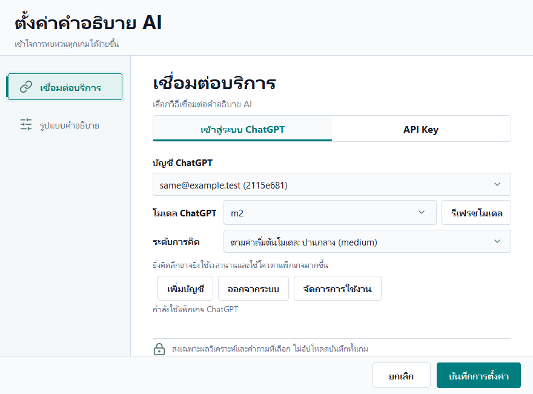

## Remaining release gates

Real Windows authorization, model discovery, plan-backed commentary and secure
restart have now passed as described above. Actual expiry-triggered refresh and
remote revocation remain unverified; the owner's active grant was intentionally
not revoked. Mock OAuth/SSE tests do not substitute for those remaining gates.
The PR must not be merged or published on the basis of this report alone.

The latest changes have not been physically tested on macOS or Linux. Prior
macOS evidence is retained in the earlier QA reports, not relabeled as a test of
this candidate. Native screen-reader speech has not been verified here.

## Screenshot evidence

Settings captures below are from actually displayed Swing windows with synthetic
accounts. They are distinct from the product EXE screenshot. No real account,
authorization URL, code, token or key is included.

### Thai glyphs and selected sidebar

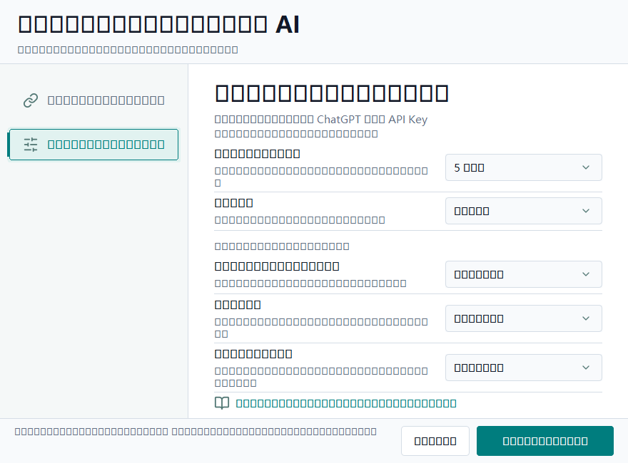

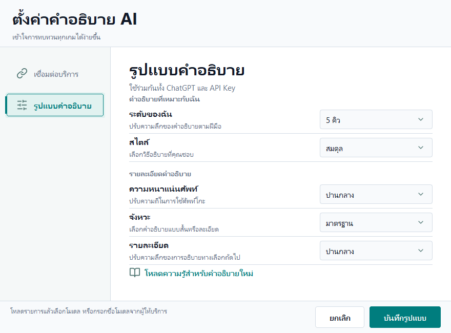

### Main commentary Thai glyphs

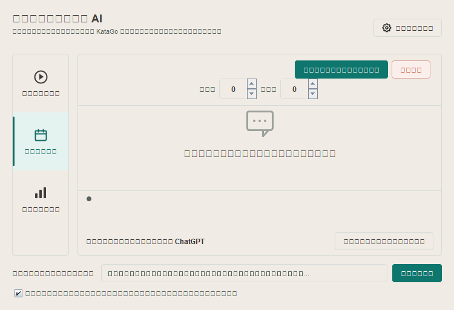

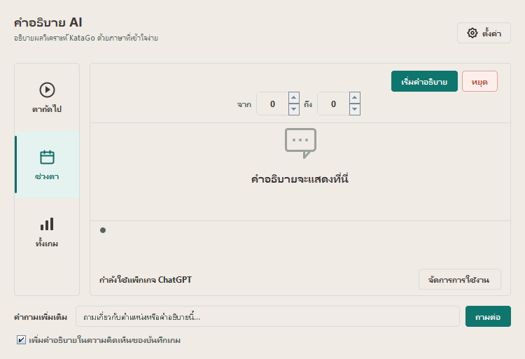

Both main-commentary captures use JVM 200% scaling.

### Japanese footer at JVM 150 percent

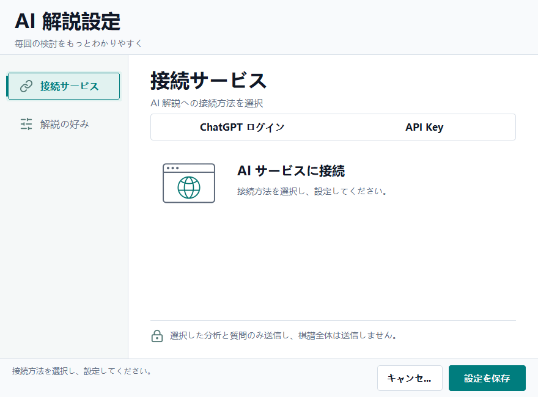

### Real Windows EXE, before authorization

