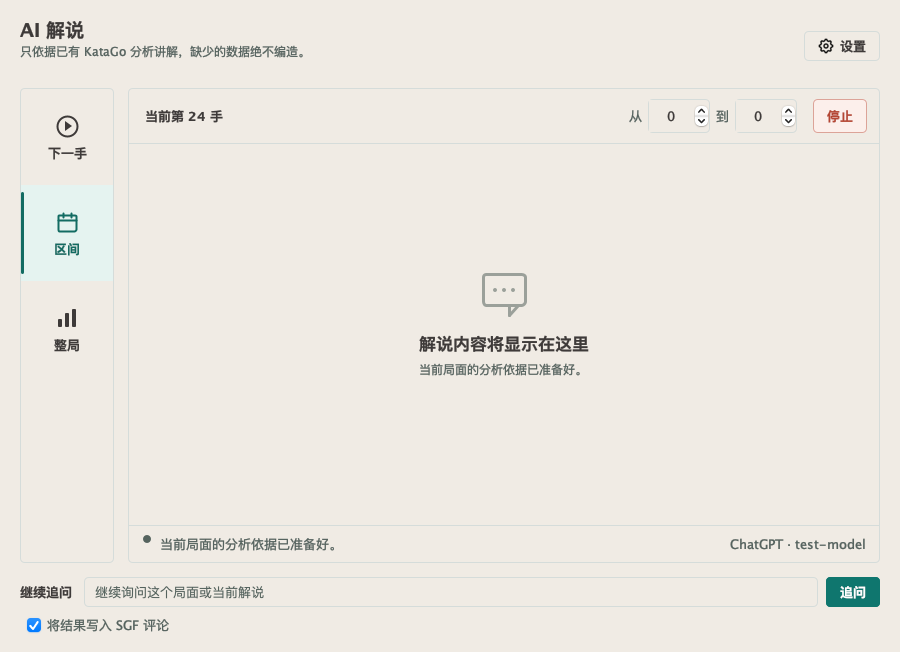
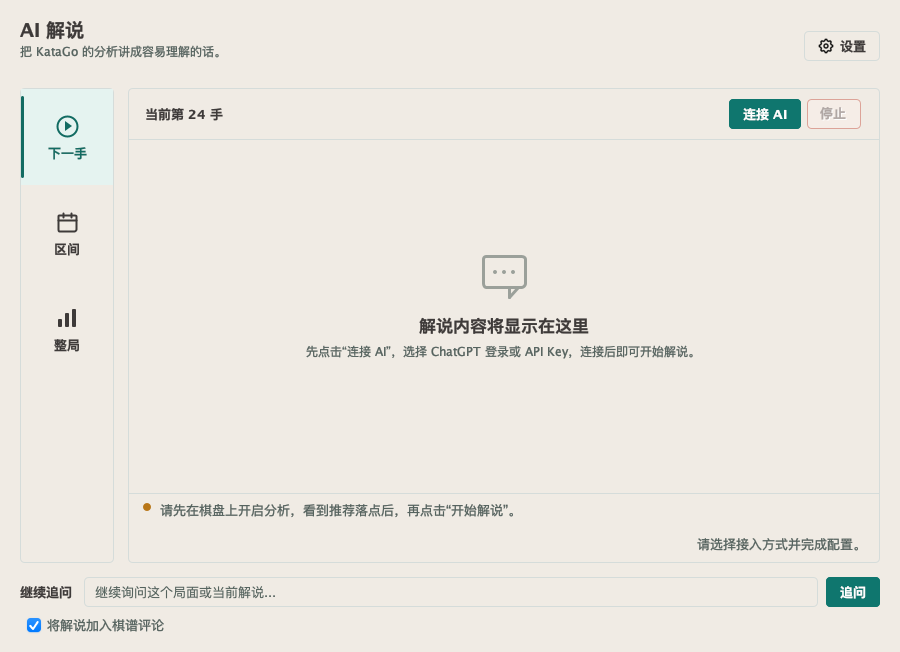
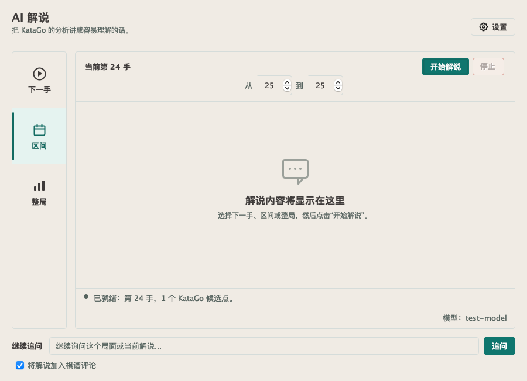
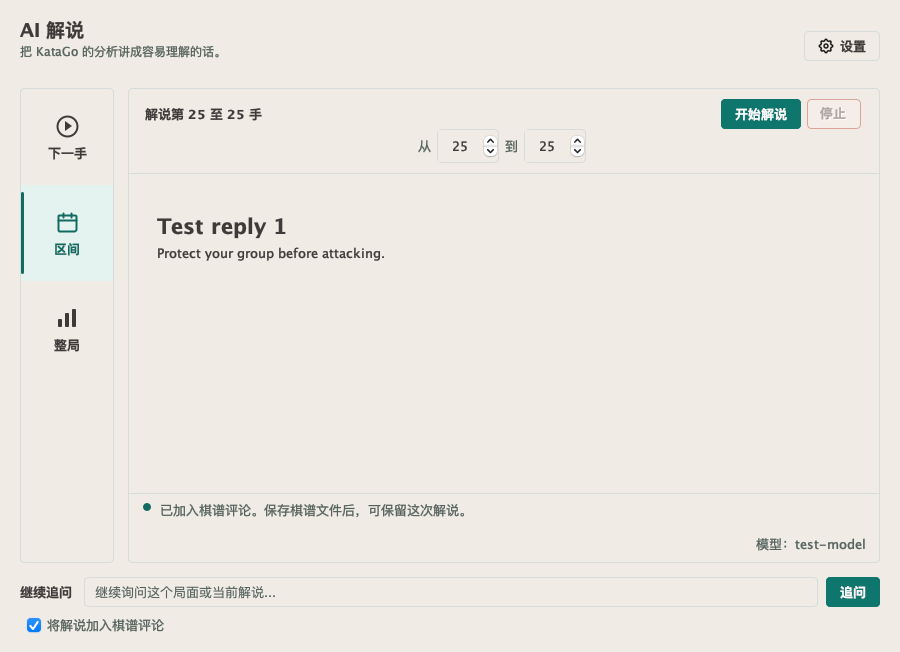
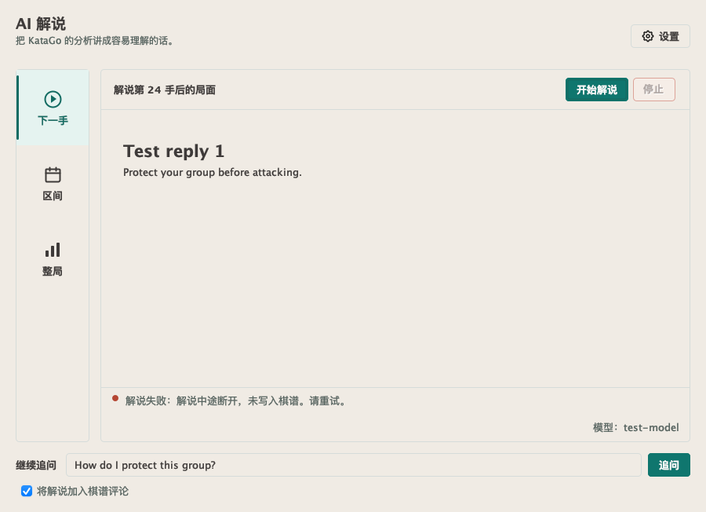

# AI commentary user-flow audit, 2026-10-01

## Scope

This run exercises the actual Swing commentary/settings dialogs on macOS with isolated
configuration, synthetic KataGo evidence and a loopback fake API. No personal credentials,
paid inference, release or replacement of the user's signed application is involved.
Screenshots are renders of the displayed native Swing component tree, not design mockups.

## Findings and repairs

1. **Connect: fixed / pass.** First use now offers one clear Connect AI action, even before
   a position has analysis. Connection and teaching preferences remain separate. Existing
   ChatGPT/API Key choices, model and thinking-depth behavior are retained.
2. **Select and start: fixed / pass.** Mode buttons previously submitted immediately, before
   the user could choose the range. They now select scope only; Start commentary submits once.
   Range controls appear only when relevant and typed spinner values are committed before use.
3. **Read and follow up: fixed / pass.** Questions previously reused the original evidence but
   wrote to whichever board node was current. Both new and saved commentary now keep their
   evidence/write-back node when the user browses. The header states the commentary scope.
4. **Stop, recover and save: fixed / pass.** Cancelled setup previously erased the question;
   cancellation/failure now preserves it. Partial output is not treated as completed conversation
   history or written to SGF. Loading another game cancels old callbacks and clears old questions.
   Completed commentary explicitly says to save the game file to retain it.

The API-key SSE parser previously accepted EOF without a completion signal. A failing regression
first reproduced that defect. It now requires a terminal success signal and rejects malformed,
failed, incomplete, filtered or token-limited responses. A completed Chat Completions response
does not wait indefinitely for socket closure. Stream error messages redact the actual API key.
Completion semantics were checked against the official
[streaming guide](https://developers.openai.com/api/docs/guides/streaming-responses) and
[Chat Completions reference](https://developers.openai.com/api/reference/resources/chat/subresources/completions).

The existing palette and layout are preserved. Copy is simpler, status text can wrap, and we
removed the unrealistic claim that an LLM can never invent missing information. KataGo remains
the source of analysis evidence; these changes do not prove the model's explanations infallible.

## Visual evidence

## Validation

Final verification on JDK 21 passed:

- Native commentary/settings and teacher regression suite: 150 tests, zero failures,
  errors or skips. This includes the actual macOS Swing dialogs with a fake loopback API.
- Full headless Maven `verify`: 4,564 tests, zero failures/errors, 112 skipped;
  integration phase: seven tests, zero failures/errors, six skipped. Opt-in desktop,
  credential and engine tests are not counted as passed by this headless run.
- Shaded JAR packaging and the packaged logging-provider smoke test passed.
- Line-ending scan, six line-ending checker tests, Markdown link check and
  `git diff --check` passed. No repository-wide formatting was performed.

The native suite checks all seven shipped locale bundles and minimum-size button boundaries.
It includes first use, missing analysis, typed ranges, duplicate activation, follow-up after
browsing, saved-commentary follow-up, settings cancellation, interrupted response, retry,
stop, new-game late callbacks and the unchanged connection-settings suite.

## Limits

This is not a Windows physical-desktop/DPI, NVDA/VoiceOver, signed-package upgrade, or real
paid-inference acceptance run. Headless/CI results do not substitute for those checks. Existing
model quality, whole-game summarization limits and the user's real secure-store authorization
were not changed. No unsupported hardware or platform is claimed as passed.
