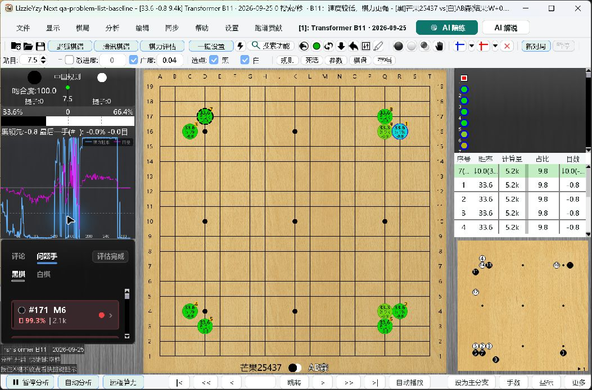
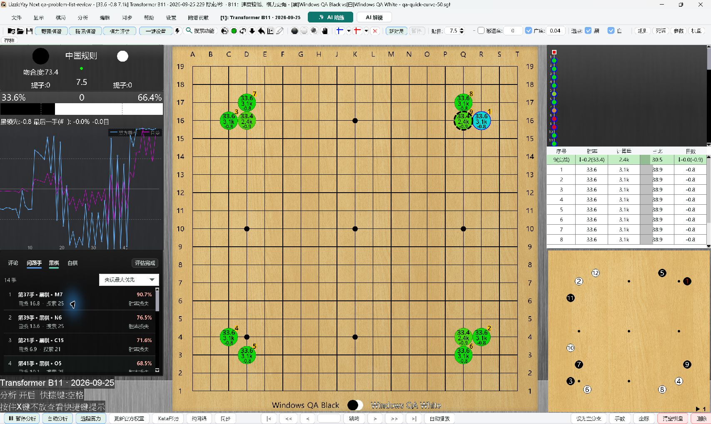
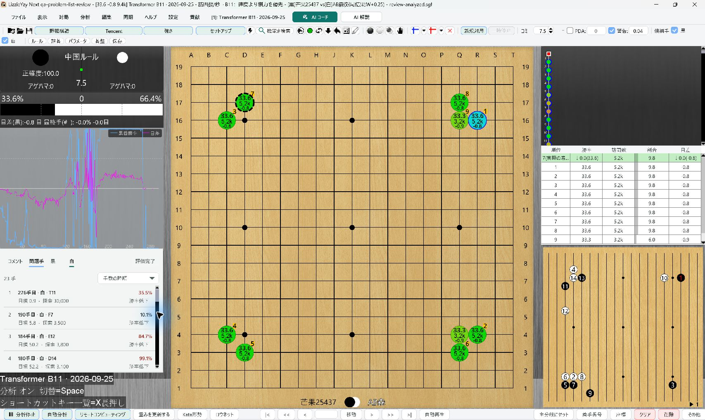
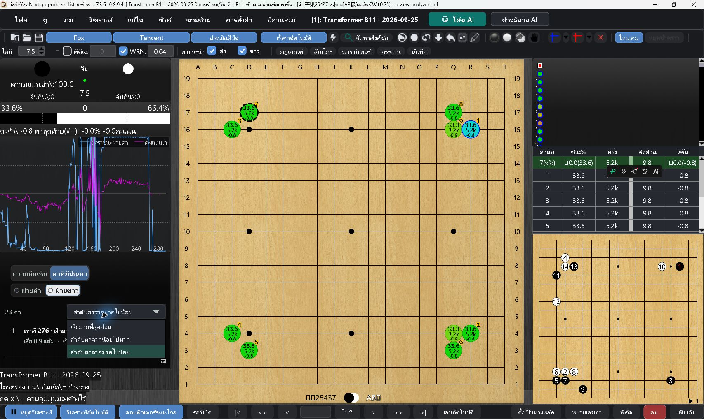

# Problem-move review list: Windows acceptance

## Scope and environment

- Base: `bba4663c754e872d7e67a4a4736d239ec03b9e00` (`origin/main`).
- Windows 11 Pro 23H2, build 22631.6199; NVIDIA RTX 3070.
- Isolated copy of the verified `next-2026-10-08.1` NVIDIA portable, launched with
  `LizzieYzy Next NVIDIA.exe`, bundled Java 21 and the candidate application JAR.
- Local KataGo v1.18.2 CUDA / B11 2026-09-25 performed real inference. The user's
  existing installation, remote account, configuration and engine cache were not changed.
- A real saved analyzed SGF with over 200 moves and both black/white mistakes was
  loaded through the normal SGF startup argument. A separate legal 50-move SGF
  without analysis verified automatic quick analysis and live list updates.

## User-facing checks

| Scenario | Observed result |
| --- | --- |
| EXE startup | Main window appeared, bundled model loaded, local analysis continued. |
| Default order | Highest winrate loss first; ordinals are distinct from game move numbers. |
| Chronological orders | Ascending and descending options work by mouse and keyboard. |
| Selection after sorting | Selected move 175 remained selected after changing its list position. |
| Mouse navigation | Move 171 opened position 170; move 48 opened position 47, with problem marker. |
| Keyboard navigation | Down moved selection without navigation; Enter/Space opened the selected position. |
| Focus traversal | F6 reached the sidebar header; Tab reached sort and list; Shift+Tab returned to sort. |
| Filter and scrolling | Black/white lists update; ordinals remain continuous; no horizontal scrollbar. |
| Refresh | Analysis continues without resetting the current selected entry or visible anchor. |
| Restart | `move-desc` and the white filter persisted and reappeared after restart. |
| Unannotated SGF startup | Organizing state changed to populated results and evaluation complete. Same-window game replacement is covered by regression tests, not native file-dialog input. |
| Quick curve | Coarse curve was followed by the completed real curve; foreground analysis resumed. |
| Theme | Classic and Apple styles tested; custom light sidebar keeps matching header/background. |
| Localization | Simplified/traditional Chinese, English, Japanese, Korean and Thai inspected in EXE. |
| Scaling | Native desktop setting plus JVM 1.0, 1.5 and 2.0 combinations; not a full Cartesian matrix. |

Two additional problems were found during visible Windows acceptance:

1. The classic white filter used a near-white underline, invisible on light
   backgrounds. Both filters now use a contrast-aware accent; black and white
   were retested in the EXE. A pixel regression verifies both backgrounds.
2. Tab into a list with no selection provided no visible row focus. Focus now
   selects the first visible row without navigating or replacing an existing
   selection; regression and native retest results are recorded below.

## Automated validation

Final validation is in progress. Current results are not a release sign-off:

- Final focused run: 51 tests, 0 failures, 0 errors, 1 platform skip.
- Earlier full candidate: 4,842 unit tests and 18 integration tests, 0 failures,
  0 errors, 140 total conditional skips. This predates the two additional fixes.
- The next full run ended early in `CommandLaunchHelperTest`: 4,457 tests
  reported, no assertion failures, but the forked JVM exited without completing
  Surefire. It is a failed run, not a pass. The isolated 13-test helper class
  subsequently passed (1 non-Windows skip); final full verify is rerunning.
- Windows repository checks: 2/2 passed (line endings and diff whitespace).
- Windows script checks: the first 7 steps passed. Product acceptance fixtures
  ran 29 tests with 6 failures: Windows denied access when starting generated
  temporary fixture EXEs. A security-product window appeared at the same time;
  the blocking cause has not been confirmed. No protection settings were changed
  and no isolated files were restored. Remaining script checks are not passed.
- Final focus-indicator native retest and final packaging are pending.

Focused tests cover numeric sort, equal-loss ties, preference round-trip, side
filtering, full-row hit boundaries, blank-tail/separator clicks, press/release
identity across refreshes, selection/scroll retention, game replacement,
keyboard activation, accessible labels and renderer reuse. Layout coverage
includes six locales, light/dark themes, fonts 14/20 and widths 160/240/360/540.

## Evidence

Before, populated baseline EXE:

Candidate EXE, real quick analysis of an unannotated fixture:

Light theme, selected white filter after the contrast repair:

Thai sorting popup, JVM 200% simulation:

Full local evidence: `C:\ailearn3\lizzieyzynext\.qa\problem-list-20261009`.

## Limits

- JVM scale overrides are **not** changes to Windows display scaling. Native
  Windows 100%/150%/200% setting changes were not performed in this run.
- Accessibility names and keyboard behavior were tested. NVDA/Narrator speech
  was not listened to; the automation tree did not expose Swing child controls.
- The Windows native file chooser was not reliably targetable by the desktop
  tool; SGF startup arguments were used instead of claiming file-dialog clicks.
- Headless or opt-in tests skipped by Maven are not native desktop passes.
- macOS/Linux desktop and other GPU hardware were not tested on this machine.
- This change does not alter engine protocols, remote connections, analysis
  algorithms, problem thresholds or training lifecycle behavior.
