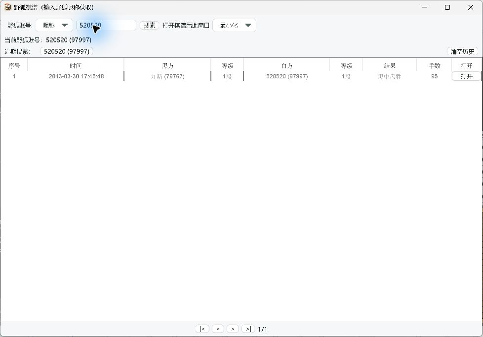
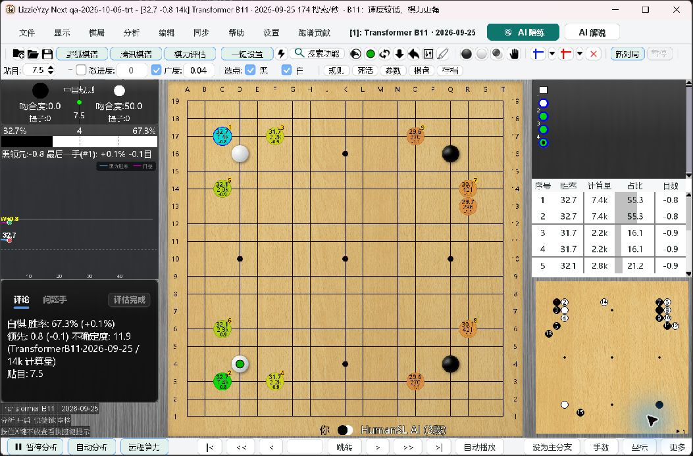

# Windows PR acceptance, 2026-10-06

## Scope and provenance

- Repository: `wimi321/lizzieyzy-next` (Java Swing only).
- Base: `b768c7707b68bf1d966c5019cede4a7143999042`.
- Tested integration: `470ee88d5ba348ec7cb946a84740ea6168402d29`.
- Ancestry consolidation: `03202192ab183a5c0a0e71e803127fbfca8d6e17`.
  `git diff --exit-code 470ee88d 03202192` returned zero: no file changed.
- Consolidated Git tree: `e6b16cb67c2b968da2ff54c2d50cfae75531adaf`.
- Candidate shaded JAR SHA-256:
  `99f597e11d5273d7efc3bd598976dc69ee067da65fc892fe2b3541408377cace`.
- PRs: #590, #591, #592, #593, #594 and #595. Draft #575 is excluded.
- All execution used isolated QA data. Existing installations, credentials,
  configuration, engine caches and the dirty primary checkout were preserved.

The consolidated branch retains contributor commits and the separately reviewed
fix heads. Its CI must pass against the current main before merge. This report is
not a claim that the final public release archive or every platform has passed.

## Environment and portable copies

- Windows 11 Pro 23H2, build 22631.6199.
- NVIDIA RTX 3070 Laptop, 8 GiB; driver 560.76.
- Build: Oracle JDK 21.0.2, Maven 3.9.6, Python 3.12.14.
- EXE runtime: bundled Adoptium Java 21.0.12.1, not the build JDK.
- Source archive: `2026-10-01-windows64.nvidia.portable.zip`.
- Archive SHA-256:
  `60470d1f20135a83cf99f46b20aab97506c06d783ac44fb91a8d0444fda29867`.
- Launcher: `LizzieYzy Next NVIDIA.exe`, SHA-256
  `5ac5f2141cb0808805f613c0848a021bd7dc63b8c4b968e524a65d893e3bf617`.
- The CUDA copy uses this archive plus the candidate JAR. The TensorRT copy is
  a locally assembled layout using pinned, verified engine/runtime assets, the
  same launcher and the candidate JAR; it is not an unmodified published TRT ZIP.
- B11 model SHA-256:
  `4a6312e80faadee7b7dd28689a2e87a1efb4640c10132f16290da7a17b4c6d9e`.
- HumanSL model SHA-256:
  `637746e44f0efe00ad1245a50aa9bbf0716efe364c43965ead97bd6835d84ab5`.

## Bugs found and retested

1. #590 made both Fox search choice combo boxes unfocusable. Restored normal
   keyboard focus and added a child-JVM test of the production dialog. The test
   failed before the fix and passed after it. Actual EXE Tab/Shift+Tab, choice
   navigation, numeric-nickname lookup and explicit UID lookup also passed.
2. Headless desktop-probe diagnostics spawned a screenshot JVM that cannot
   capture a headless display. #594 keeps thread diagnostics, records an explicit
   screenshot skip, and preserves timeout/cleanup behavior. Production code is
   unchanged.
3. While assembling the TRT test copy, omitting `nvonnxparser_10.dll` caused a
   native `0xC0000135` exit, although preflight reported readiness. This is not a
   claim that the published package omitted the DLL. #593 now requires the parser
   for verified Transformer TRT, without imposing it on the CUDA HumanSL
   companion or changing legacy requirements. Red test: 1 failure; green focused
   suite: 131 tests, 0 failures/errors/skips. Restoring the DLL also made the
   actual engine version command and neural inference succeed.
4. The native Socket.IO loopback test exposed an automatic quick-curve recovery
   race: a requested reconnect could be treated as terminal failure before the
   new transport was ready. An old reader's recovery request could also survive
   transport replacement. #595 scopes recovery to the owned transport and waits
   only for an active recovery. Red tests: 2 warmup failures and 1 stale-reader
   failure. Green focused suite: 242 tests, 0 failures/errors/skips. The real-engine
   suite initially failed 1 of 10 cases; after the fix, all 12 passed, including
   three consecutive disconnect-during-analysis cases. Logs retain both outcomes.

## Automated results

| Invocation / scope | Result |
| --- | --- |
| `scripts/run_local_ci.ps1 -Profile All -RequireClean` | 65/65 steps passed, 647.922 seconds |
| Full Windows Maven `verify`, including packaging and `LoggingProviderSmokeIT` | 4,721 tests; 0 failures; 0 errors; 116 skipped; 422 suites |
| Windows product acceptance fixtures within All | 29/29 passed |
| Real CUDA and production Socket.IO loopback engine acceptance | 12 tests; 0 failures; 0 errors; 0 skipped; 4:08 minutes |
| Final visible Swing / layout / accessibility regression selection | 109 tests; 0 failures; 0 errors; 0 skipped; 1:02 minutes |

All includes launcher/JCEF/NVIDIA packaging, release asset and provenance helpers,
Python and shell checks, PowerShell parsing, Markdown links, line endings and
`git diff --check`. The 116 skipped tests are not counted as executed acceptance.
The explicit engine and desktop suites are separately recorded, not folded into
the full-suite count.

The desktop selection was `B11SpeedNoticeDesktopTest`, `B11SpeedNoticePanelTest`,
`FoxKifuDownloadAccessibilityTest`, `AccessibilitySupportTest`,
`WorkbenchStyleTest`, `RemoteComputeDialogLayoutTest`,
`RemoteComputeRefreshButtonTest`, `KataGoAutoSetupDialogLayoutTest`,
`MenuAiFeatureButtonLayoutTest`, `TeacherDialogViewTest`, and
`WindowMenuStripTest`, with `-Djava.awt.headless=false -Dfmt.skip=true`.

The B11 desktop probe creates actual production Swing windows with synthetic
model metadata and benchmark results. It covers six languages, plus `zh_HK`
compatibility, at JVM UI scales 1, 1.25, 1.5 and 2. It does not run a benchmark and
does not prove physical Windows scaling or actual screen-reader speech.

## Actual Windows EXE interaction

| Scenario | Observed result |
| --- | --- |
| Fresh CUDA portable | Normal main window; automatic B11 analysis; first-time flag persisted false; valid default engine index 0 |
| Fox numeric nickname and UID | Numeric nickname resolved as a nickname; explicit UID returned the expected account; public game list loaded |
| Fox game opening | A 246-move game loaded, quick curve completed, foreground visits resumed |
| Alt+O | Bundled readboard v3.0.6 opened visibly from the isolated directory and closed normally |
| TRT B11 | Real neural inference and positive visits; no startup failure after valid runtime assembly |
| TRT HumanSL training | Started via the toolbar and dialog; separate pinned CUDA companion; two human moves and two AI replies |
| End training | Companion exited; automatic review curve completed; foreground TRT visits continued without an error dialog |
| Local SGF | Opened a synthetic 50-move SGF via the actual file chooser; quick curve completed without a second cold TRT analysis process |
| Pause / continue | Button state changed and foreground visits resumed on continue |
| Predicted-point input | Three successive visible recommendation clicks placed stones and resumed analysis; no hang observed, not a latency benchmark |
| Final JAR retest | Restarted EXE with the final JAR hash above; repeated training, two AI replies, end/review and foreground recovery successfully |

Fresh TRT initialization in this isolated low-driver configuration took roughly
110 seconds, including compatibility-probe and foreground cache preparation.
The UI remained responsive. Do not describe this as instant startup or a measured
performance improvement. Warm restart also loaded successfully.

### Captured UI evidence

## Evidence and limitations

Local evidence root:
`C:\ailearn3\lizzieyzynext\.qa\pr-acceptance-20261006`.

- `final-all/local-ci-summary.json`, `final-all.log`, `final-all-surefire`,
  `final-all-failsafe`: final full gate and exact source SHA.
- `native-engine.log`: original failing run; `native-engine-fixed.log`,
  `native-engine-fixed-reports`, `native-engine-fixed`: corrected native tests.
- `desktop-final.log`, `desktop-final-reports`, `desktop-final-probes`: final
  visible-window evidence, including per-language PNGs.
- `screenshots/01-cuda-b11.png` through `10-final-trt-coach-review.png`: manual
  portable evidence. Earlier screenshots retain their earlier-candidate scope;
  screenshot 10 specifically covers the final JAR.

The remote tests use the production Socket.IO transport with a local real-KataGo
server. They are not a live Zhizi account/service or Internet-outage certification.
No credentials are published in this report. Physical Windows DPI switching,
NVDA/Narrator speech, macOS/Linux desktop hardware and RTX 50 hardware were not
revalidated in this run. Draft #575 remains separate, including its outstanding
real authorization-revocation gate. No release is certified by this report.

Conclusion: PASS for the explicitly executed #590-#595 Windows integration
scenarios. This is not an unconditional whole-product or #575 acceptance.
