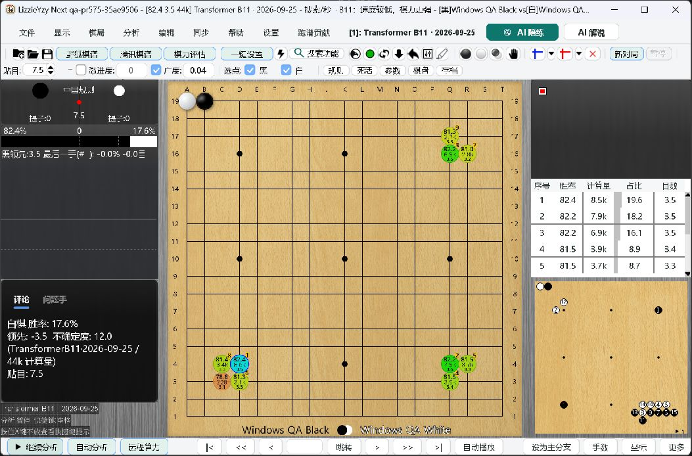
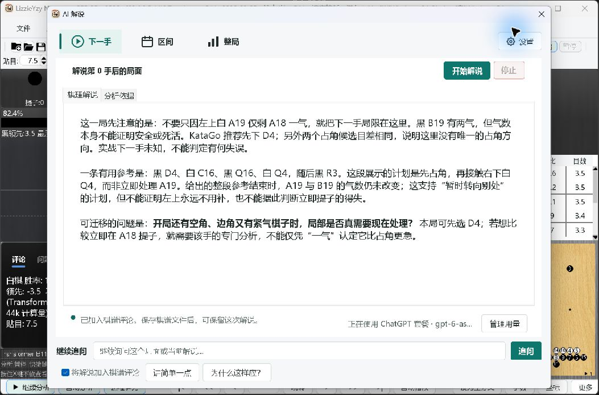
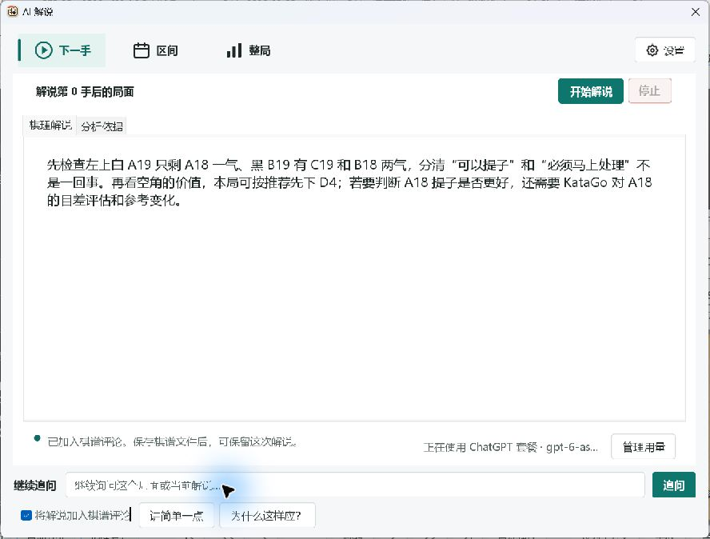
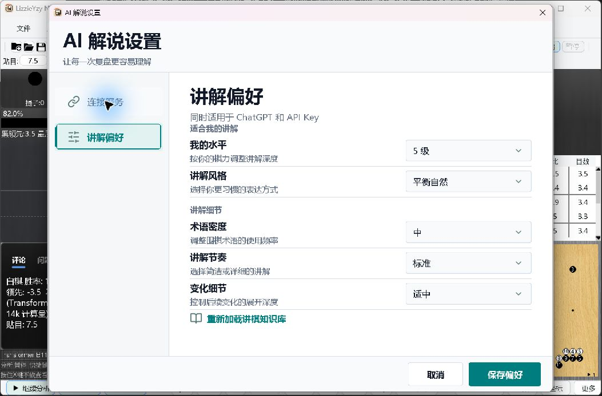
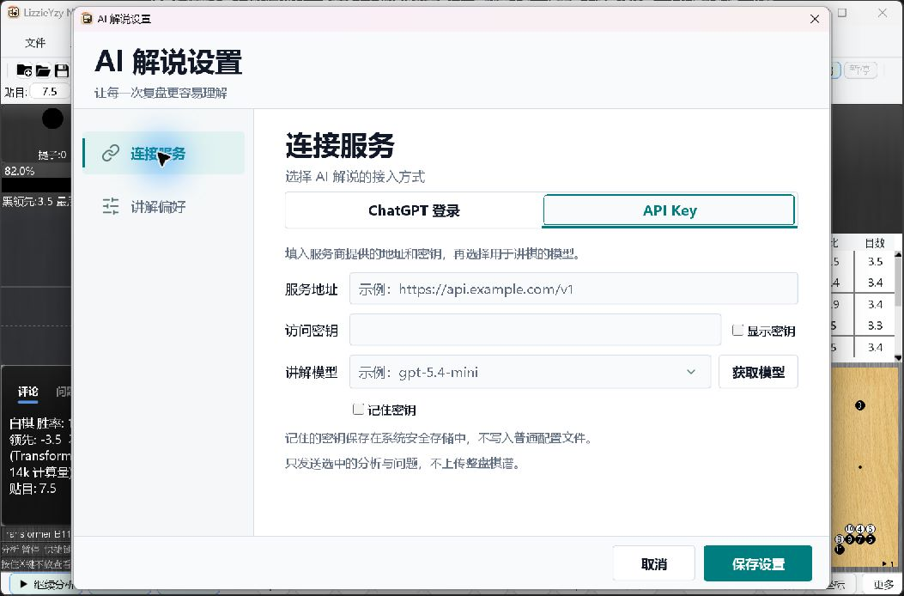
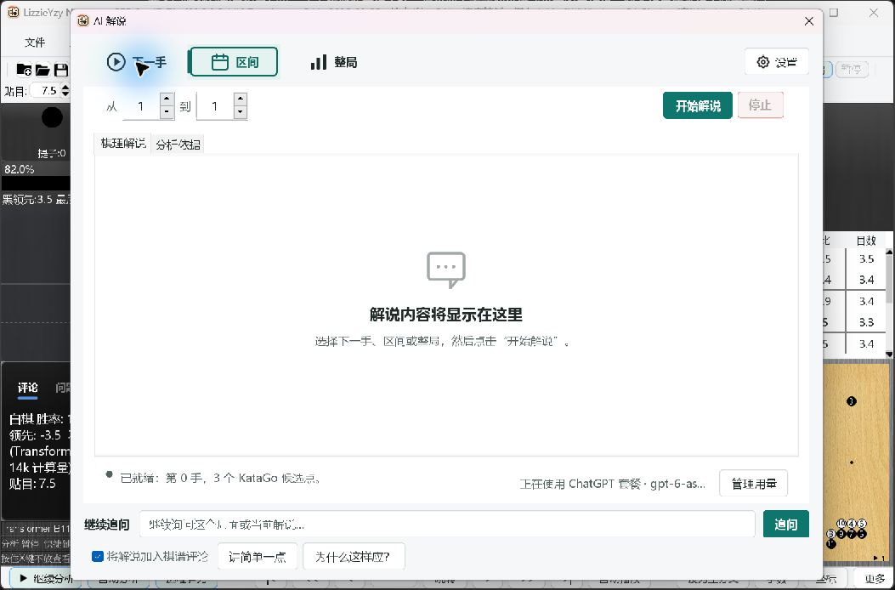
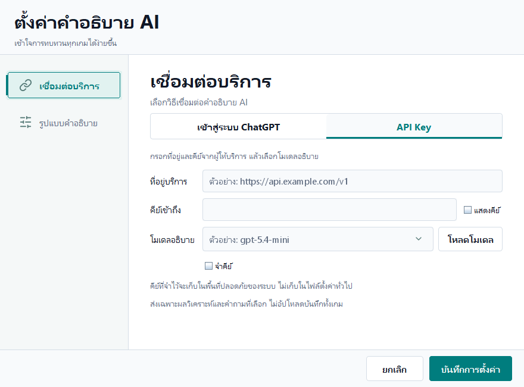

# Windows PR 575 Acceptance: 2026-10-06

## Result and Candidate

**The Windows functional scenarios below pass. The complete release gate is not
yet PASS.** Real OS scaling, remote grant revocation/re-authorization, and Linux
Secret Service integration remain unverified. Keep PR 575 Draft; this report
does not authorize merging or publishing.

- Main: `b82b6611b7dc4ce92d1a0f5e2d2063b585201617`.
- Incoming PR 575: `9d30778425de5f50a9fb62f9fdcf935d587063bf`.
- Integration: `ae0f284d069164fec71a7e3253696c21a6b87b6d`.
- Keyboard fix: `8aa47c7f44cbb5f6debb78762f1aa05374cfe0e7`.
- Final tested source: `35ae9506fa4c8fd6854485a8d1a2552796aed978`.
- Remote main and PR head were rechecked after testing and had not changed.
- Windows 11 Pro 23H2, build 22631.6199; RTX 3070 Laptop, driver 560.76.
- Build: JDK 21.0.2, Maven 3.9.6. Portable runtime: Java 21.0.12.1,
  including `jdk.httpserver` and `jdk.accessibility`.
- EXE: `LizzieYzy Next NVIDIA.exe`, isolated NVIDIA portable, QA version
  `qa-pr575-35ae9506`.
- Tested shaded JAR SHA-256:
  `c10e2cad8e0e221b09d42a22a8e6606bdf283819dc37a0aecf89a3cf0320b806`.

All changes and runs used an isolated worktree and disposable portable copy.
The primary dirty checkout, real installation, user configuration and engine
caches were not overwritten. Only this application's previously authorized
isolated ChatGPT session was used. No other application's credentials were read.

## Bugs Found and Fixed

### Keyboard selection did not switch content

In the actual Windows EXE, arrow navigation selected the preferences sidebar
button while leaving the connection form visible. The provider tabs and
NEXT/RANGE/WHOLE mode group had the same event mismatch: Swing selection changes
do not necessarily fire an `ActionEvent`.

`TeacherSettingsDialog` and `TeacherDialog` now react to selected `ItemEvent`s.
Provider initialization stays explicit while its controls are disabled. Two
regressions check selection-only navigation, effective mode, visible content,
preservation of unsaved API input, and absence of implicit settings persistence.
Before the fix both tests failed; after it both pass. Mouse behavior and actual
arrow navigation were retested in the EXE. No account protocol, credential
storage or engine production code changed in this fix.

### Remote restore test raced its first snapshot

The first full gate after the UI fix exposed a race in
`LeelazExclusiveRemoteGtpSessionTest.foregroundRestoreRetryFailsClosedWhenMirrorBecomesReserved`.
Waiting for a resend counter did not mean the snapshot had completed. Reserving
the mirror too early could correctly clear the session before a reflective test
helper dereferenced it.

The test now uses the existing protocol fixture, waits for the first snapshot's
final `name` command, then reserves the mirror and releases the pending response.
It exercises retry admission through the actual response handler. The 64-test
class and the subsequent full gate pass. Production restore behavior is unchanged.

## Automated Results

Commands ran serially in the same checkout. The full gate ran on clean source
`35ae9506`; the later report/screenshot commit is documentation only.

```powershell
scripts/run_local_ci.ps1 -Profile All -RequireClean -SummaryDir <evidence>/all-resumed
mvn -B -Dfmt.skip=true -DskipTests package
```

| Check | Result |
| --- | --- |
| Local All | 66/66 checks passed, 627.4 seconds |
| JUnit collected by All | 4,843 tests, 0 failures, 0 errors, 138 skipped |
| Independent package | BUILD SUCCESS, 9.976 seconds |
| New keyboard regressions | 2 tests, 0 failures/errors/skips |
| Remote restore test class | 64 tests, 0 failures/errors/skips |
| Native Swing, JVM scale 1.0 | 37 tests, 0 failures/errors/skips |
| Native Swing, JVM scale 1.5 | 37 tests, 0 failures/errors/skips |
| Native Swing, JVM scale 2.0 | 37 tests, 0 failures/errors/skips |
| Packaged Java callback probe | `CHATGPT_LOOPBACK_SMOKE_OK` |
| Saved session/model probe | `MODEL_CATALOG_OK count=4 sessionOnly=false` |

All includes full Maven verification and logging-provider integration, Windows
credential persistence, launcher/JCEF/NVIDIA packaging checks, release helpers,
line endings, Markdown links, shell/PowerShell parsing, and `git diff --check`.
The 138 conditional skips are not passes; native opt-in tests were run separately.

Native matrix selection:

```text
ChatGptSettingsNativeTest,TeacherCommentaryNativeTest,TeacherDialogViewTest,
TeacherTypographyTest,TeacherDialogMarkdownTest,TeacherSettingsAssetsTest
```

Each invocation used `java.awt.headless=false`, `lizzie.test.chatgptNative=true`,
`lizzie.test.commentaryNative=true`, and a distinct `sun.java2d.uiScale` value,
user-data directory, screenshot directory and Surefire report directory. The
settings and commentary fixtures exercise zh-CN, zh-TW, zh-HK, en-US, ja-JP, ko
and th-TH. Thai, Japanese and Traditional Chinese output was visually inspected.
These are native Swing fixtures with **JVM simulated scaling**, not physical
Windows display-scaling certification or seven real-account login sessions.

Superseded runs remain in local evidence: `all-fixed` failed with 4,825 tests,
0 failures, 1 error and 123 skips due to the test race above; `all-complete` was
interrupted at the user's request and is not counted as passing. Older successful
runs on a different candidate are not substituted for `all-resumed`.

## Actual EXE and Account Scenarios

| Scenario | Actual result |
| --- | --- |
| Fresh isolated EXE | Main window opens, bundled Java and B11 CUDA load; observed roughly 459-488 visits/s, then 44k visits before pausing |
| Saved ChatGPT session | Bundled-Java probe and EXE restore the app's DPAPI login without borrowing another app's tokens |
| Official model catalog | Four account models loaded; selected `gpt-6-astra` and `low` retained; catalog reports this model's default `medium` |
| Synthetic SGF teaching | Online response explains liberties and alternatives, not just winrate; successful text is stored in the SGF node comment |
| Space | Focused Start button starts real generation and completes |
| Stop during generation | Changes to stopped state; controls become usable again; not merely a click after completion |
| Esc and reopen | Commentary closes; reopening restores the completed SGF-node commentary |
| Enter follow-up | Sends a two-sentence teaching question; completed response names correct liberties and explicitly requires additional evaluation before judging an unassessed move |
| Sidebar arrows | Preferences/connection selection, page content and save-button meaning change together |
| Provider arrows | API Key and ChatGPT content switch together; returning restores model and effort selection |
| Mode arrows | RANGE reveals range inputs; WHOLE hides them; effective mode matches selection |
| Tab / Shift+Tab | Moves from preferences rail into the associated rank control and back |
| Settings Esc | Closes the child dialog normally |

Synthetic position only:

```sgf
(;GM[1]FF[4]CA[UTF-8]SZ[19]KM[7.5]RU[Chinese]
PB[Windows QA Black]PW[Windows QA White]AB[ba]AW[aa]PL[B])
```

The response correctly described white A19's liberty A18 and black B19's
liberties C19/B18. It did not equate one liberty with proven death or invent a
loss for an unknown next move. This is a reproducible teaching smoke test, not
proof that every generated strategic statement will be correct.

Natural access-token expiry and persisted refresh were already verified in
the [October 3 follow-up](windows-pr575-followup-20261003.md), without backdating
credentials: one write, future expiry, and successful new-JVM restore. This is
now a completed gate, distinct from remote revocation.

## NVDA and Remaining Gates

Portable NVDA 2026.2 ran against the actual EXE with Java Access Bridge enabled
only in its isolated launcher configuration. Its speech log identified the
Start button, selected commentary tab, labeled preference control and read-only
multiline AI result, and emitted the actual opening sentence after Ctrl+Home.
This verifies NVDA speech output, not a human-certified pronunciation/listening
test. The dedicated NVDA process was stopped after testing. Raw logs and account
screenshots are private and are not committed.

- **Physical OS DPI:** Settings still exposed no targetable window. No Windows
  display setting was changed. 100/150/200% results above are JVM simulations.
  User assistance opening the Display page was requested; no result is claimed.
- **Real remote grant revocation:** permission to revoke only the isolated test
  session and have the account owner log in again was requested. No response has
  been received, so the working login has not been revoked. Mock invalid-grant
  and transient-network tests do not replace this real scenario.
- **Linux Secret Service:** no Linux environment was available on this Windows
  machine. No native integration PASS is claimed.
- **macOS latest candidate:** earlier PR evidence is retained, but this Windows
  run does not certify the final candidate on macOS hardware.

## Evidence

Private root: `C:\ailearn3\lizzieyzynext\.qa\pr575-final-20261006`.
The tested EXE is in `portable-resumed`. Full counts are in
`all-resumed/local-ci-summary.json` and `native-fixed-matrix-summary.json`.
Six-language component captures are in `native-fixed-{1.0,1.5,2.0}`. The safe
screenshots below are copied from that run; no account identifiers or tokens are
included.















